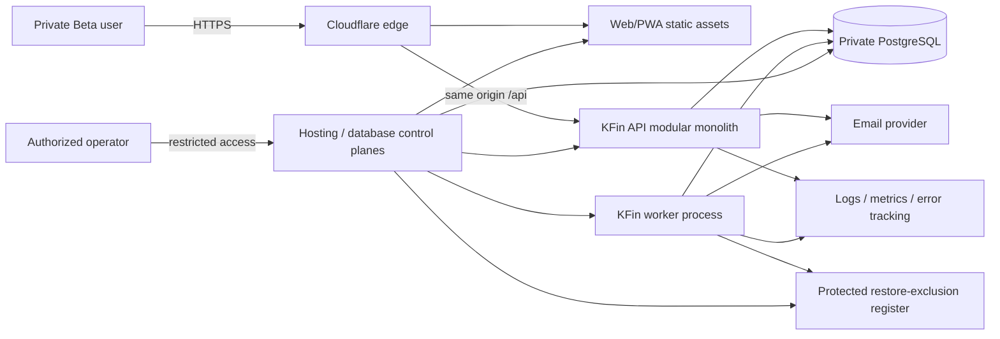
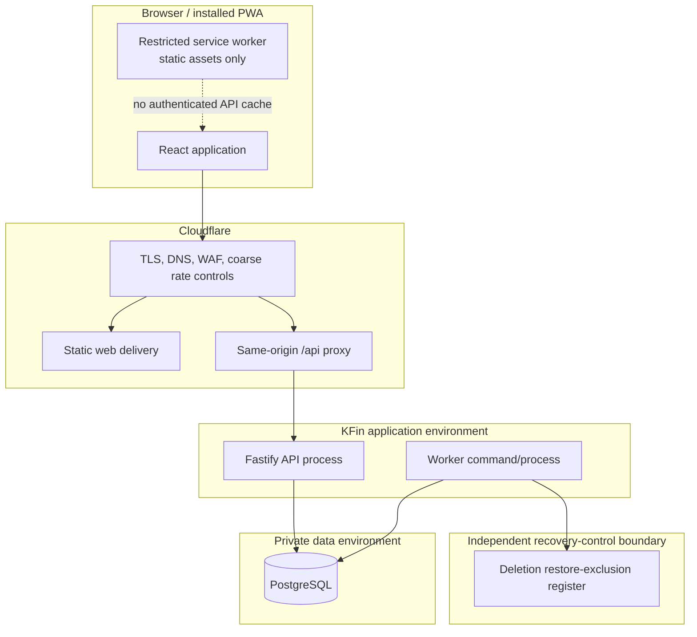

# KFin Architecture Specification

**Status:** Draft — review required<br>
**Architecture style:** Proposed modular monolith<br>
**Scale target:** Private Beta, at most 50 real users<br>
**Related ADRs:** [ADR index](ADR/README.md)

## 1. Architecture objectives

KFin must provide strong user isolation, correct financial calculations, secure persistent sessions, excellent responsive UX, and recoverable operations without infrastructure intended for a much larger product.

Priority order:

1. Financial and security correctness.
2. Clear user experience and accessibility.
3. Operability, backup, and recovery.
4. Maintainable module boundaries.
5. Performance appropriate to measured beta use.
6. Evolution without premature distributed systems.

## 2. Quality attributes

| Attribute | Architectural requirement |
|---|---|
| Security | Same-origin browser model; server-derived identity; scoped data access; revocable sessions; layered abuse controls; no public database |
| Integrity | Integer money; database constraints/transactions; idempotent writes/jobs; actual versus scheduled separation |
| Availability | Health/readiness checks, bounded retries, graceful degradation, backup and rollback procedures |
| Recoverability | Encrypted automated backups, point-in-time recovery if provider supports it, restoration drills, forward/backward-compatible release plan |
| Usability | One responsive client, fast Global Add, explicit state, accessible reusable components |
| Maintainability | TypeScript monorepo, feature modules, explicit contracts, migrations, ADRs, automated tests |
| Observability | Structured redacted logs, metrics, traces/error events where justified, correlation IDs, actionable alerts |
| Performance | Small connection pool, indexed user/time queries, bounded pagination, no N+1 aggregation paths |
| Portability | Standard container and PostgreSQL; vendor adapters for email/error tracking; no provider-specific domain logic |

## 3. Proposed technology stack

Exact versions MUST be selected and pinned to then-supported stable/LTS releases at implementation kickoff. The specification avoids stale version numbers.

| Layer | Proposal | Why it fits the MVP |
|---|---|---|
| Language/workspace | TypeScript, Node.js active LTS, `pnpm` workspaces | One language across contracts/client/server; strict types; small monorepo |
| Web/PWA | React, Vite, React Router, TanStack Query | Responsive SPA is appropriate for an authenticated product and reusable by a later Capacitor shell |
| UI | Semantic HTML, CSS custom-property tokens, CSS Modules or equivalent scoped CSS, accessible headless primitives | KFin visual system without default framework appearance; behavior can be audited |
| Forms/contracts | React Hook Form plus a schema library shared at contract boundaries | Accessible form state and consistent client/server shape; server validation remains authoritative |
| API | Fastify modular application on Node.js | Small, performant, explicit plugin/module boundaries; low operational weight |
| API description | REST/JSON under `/api/v1`; OpenAPI generated from authoritative server schemas | Inspectable, testable contract; future native client compatibility |
| Data access | Drizzle ORM/query builder with reviewed SQL migrations | Typed access while retaining PostgreSQL constraints, transactions, and explainable SQL |
| Database | Managed PostgreSQL | Transactions, relational integrity, indexing, JSON only where appropriate, mature backup tooling |
| Background work | Same repository and modules, separate optional worker process; PostgreSQL transactional outbox/job table | In-app reminders and non-secret security email without Redis/broker; secret-bearing OTP/reset delivery follows the explicit request-path exception |
| Email | Provider adapter selected before Release Candidate under OQ-17 | Required for OTP/recovery/security messages only; payment reminders are in-app |
| Tests | Vitest, Testing Library, Fastify injection/integration tests, Playwright, axe-core; containerized PostgreSQL in CI | Covers domain, API, browser, accessibility, and real SQL behavior |
| Delivery | Docker/OCI image, GitHub Actions, Cloudflare, managed compute and managed PostgreSQL | Reproducible release, TLS/WAF/rate controls, low-operations deployment |
| Observability | Pino-compatible structured logs, provider metrics, error tracking with strict scrubbing; OpenTelemetry only where it adds evidence | Useful diagnostics without building an observability platform |

Proposed libraries are not approved dependencies. Implementation kickoff must verify maintenance, licenses, security posture, bundle/runtime cost, and whether a simpler platform primitive suffices.

## 4. System context



Trust boundaries exist at the user device, Cloudflare edge, application runtime, database network, independently protected restore-exclusion register, third-party email provider, observability provider, and operator control plane.

## 5. Container/runtime view



For the smallest deployment, the API may also serve the built web assets, but browser requests must still be same-origin and caching/security policies must remain distinct. The worker may initially run as a separately invoked process/container from the same image. It is not a microservice and owns no separate domain or database.

## 6. Modular monolith boundaries

| Module | Responsibilities | Must not own |
|---|---|---|
| Identity | User/profile/status, invite eligibility, locale/timezone/base currency, deletion lifecycle and restore-exclusion intent | Password hashing/session token logic |
| Authentication | Registration, verification, login, password recovery/change | Financial data |
| Sessions | Create/validate/rotate/revoke sessions, active-session view | User-controlled authorization decisions |
| Accounts | One aggregate account, immutable balance snapshots, current-balance segments, manual known-balance updates | Bank/account-statement reconciliation, schedule, or debt policy |
| Transactions | Posted current-impact/historical-only inflow/outflow, classifications, correction/void semantics, monthly actual aggregates | Auto-posting scheduled money or silently crossing snapshot anchors |
| Schedule | Recurring definitions, generated occurrences, confirmation links | Declaring a payment complete without transaction confirmation |
| Debt | Debt profile, payment split/history, outstanding corrections | Authoritative lender interest accrual |
| Savings | Goals, manually maintained current amount/as-of date, old/new audit metadata | Contribution ledger, cash account, or verified bank balance |
| Purchases | Planned purchase lifecycle, explicit expense completion, optional atomic goal-amount deduction | Treating plans as actual expenses or auto-zeroing goals |
| Dashboard/Reporting | Read models and transparent calculations | Independent source of financial truth |
| Notifications | Fixed-stage in-app notifications for eligible outgoing obligations and deduplication; required security-email intents where applicable | Scheduled-income stages, payment-reminder email/push, or changing financial status based on delivery |
| Audit/Security | Security/audit events, abuse signals, redaction policy | General-purpose analytics payloads |
| Jobs | Outbox claim/retry/dead-letter mechanics | Domain decisions hidden from owning modules |

A module exposes application services and typed contracts. Other modules must not mutate its tables directly through ad hoc queries. Cross-module operations use a transaction-scoped application service and explicit interface, not network calls.

## 7. Proposed repository shape

This is a design proposal, not an instruction to create code during the specification phase.

```text
/apps
  /web                 React Web/PWA
  /api                 Fastify composition root and HTTP adapters
  /worker              worker composition root using the same domain packages
/packages
  /ui                  design tokens and reusable components
  /contracts           API schemas and safe shared types
  /domain              module application/domain services
  /database            schema, repositories, migrations
  /config              validated configuration contracts
  /test-support        factories and test infrastructure
/docs                   specification source of truth
```

Boundaries can be implemented with fewer packages if tooling overhead outweighs benefit. Feature ownership and dependency direction matter more than folder count.

## 8. Request and authorization flow

1. Cloudflare terminates public TLS and applies coarse network/application controls.
2. API receives a same-origin request with correlation ID and secure session cookie.
3. Global middleware validates method, content type, body size, origin/CSRF requirements, and rate-control context.
4. Session service hashes the opaque token, finds an active non-expired token/session, and derives the authenticated user ID server-side.
5. Route schema validates path/query/body. Any `userId` in client payload is rejected or ignored; ownership never comes from it.
6. Application service opens a bounded database transaction and sets the authenticated tenant/security context.
7. Repository query is scoped by user ID; composite foreign keys and proposed row-level security provide defense in depth.
8. Domain invariants and optimistic version checks run.
9. Financial write, audit metadata, idempotency result, and any outbox event commit atomically where required.
10. Response contains no secrets and applies `Cache-Control: no-store` for authenticated/sensitive data.
11. Structured logs include correlation/route/result/timing, not raw credentials, tokens, notes, or financial payloads.

Object-not-found and object-not-owned responses should be indistinguishable to prevent identifier probing.

## 9. API design constraints

- Base path: `/api/v1`.
- JSON over HTTPS; explicit content type and request-size limits.
- Resource identifiers are opaque UUIDs, never authorization secrets.
- All collection endpoints use bounded cursor/keyset pagination and deterministic ordering.
- Mutation endpoints that can create duplicate financial effects accept a client-generated idempotency key scoped to user + operation.
- Responses use a consistent error envelope with stable code, safe message, field errors when applicable, and correlation ID.
- Never return stack traces, SQL details, password/OTP/token state, internal IDs that are unnecessary, or another user’s existence.
- Updates use explicit fields and optimistic version/ETag semantics where concurrent edits matter; no blind mass assignment.
- API OpenAPI contract is generated and tested against handlers.
- Deprecation and schema changes must preserve currently deployed Web/PWA compatibility through a rollout window.

## 10. Money, time, and calculation architecture

### Money

- Store positive amount magnitudes as signed 64-bit integer minor units, with explicit direction/type and ISO 4217 currency.
- Never use JavaScript `number` for unrestricted monetary arithmetic. Use `bigint` or a reviewed integer-money abstraction and serialize safely as strings if values may exceed JSON safe integer range.
- Validate bounds before database writes and before arithmetic.
- No aggregation across different currencies.
- Formatting occurs at presentation boundaries with `Intl.NumberFormat`; formatting never feeds calculations.

### Time

- Store event instants as PostgreSQL `timestamptz` in UTC.
- Store user-intended financial calendar dates and due dates as `date`.
- Store IANA timezone on user/schedule; do not use a fixed UTC offset.
- Monthly grouping uses user-local date and an explicit selected period.
- Recurrence generation defines 29th/30th/31st, leap-day, timezone-change, and daylight-saving behavior before implementation.

### Derived values

- Current balance derives from the latest immutable balance snapshot plus posted current-impact transactions attached to that snapshot segment.
- Historical-only backfill participates in occurrence-month/category totals but not current balance; it is never inferred solely from client ownership/status fields.
- Safe-to-spend equals current balance minus unpaid outgoing occurrences due through local calendar-month end minus manual current amounts on active savings goals; projected income is excluded.
- Due/overdue derives from occurrence state + due date + user timezone; it does not mutate to paid.
- Dashboard calculations live in one reporting service with named/versioned formulas, snapshot anchor, as-of time, and source drill-down.
- Early beta can calculate on demand with indexed SQL. Materialized views/caches require measured evidence and an invalidation design.

## 11. Transaction and consistency boundaries

The following operations must be atomic:

- invitation consumption + pending user/password credential creation;
- aggregate account + initial balance snapshot creation;
- create/confirm posted transaction + balance-effect/snapshot anchor + optional schedule occurrence link + idempotency result;
- create a manual authoritative-balance snapshot + new segment metadata + audit event;
- debt payment + posted outflow + principal/outstanding update + occurrence link;
- savings current-amount update + old/new audit metadata;
- planned-purchase completion + posted expense + optional linked-goal scalar deduction/audit + purchase status;
- password reset + credential replacement + all-session revocation + challenge consumption;
- account-deletion state transition/purge checkpoint + required audit/tombstone metadata;
- security-sensitive state change + required audit event;
- domain state change + transactional outbox entry when external delivery is required.

Email delivery itself cannot be part of a database transaction. For outbox-eligible non-secret messages, the outbox records intent atomically and the worker retries delivery idempotently. Secret-bearing authentication email follows the immediate ephemeral delivery exception in section 13. Delivery failure never rolls back already committed financial truth.

## 12. Background jobs

Initial job types:

- send approved non-secret security email from durable intent;
- generate a bounded window of schedule occurrences;
- evaluate eligible outgoing-obligation in-app reminder stages at 09:00 user-local time and create each stage once;
- prune expired challenge/session/idempotency data under retention policy;
- execute/cancel due account-deletion purge jobs and maintain the independently protected restore-exclusion/tombstone register;
- operational consistency checks where specified.

Worker requirements:

- PostgreSQL row claiming with `FOR UPDATE SKIP LOCKED` or a reviewed PostgreSQL-backed library;
- unique idempotency/deduplication key per logical job;
- bounded exponential backoff with jitter;
- maximum attempts and inspectable dead-letter state;
- lease/heartbeat so crashed work becomes reclaimable;
- user and correlation context, but no sensitive payload in logs;
- lag, failures, retries, and dead-letter metrics;
- no assumption of exactly-once external delivery—handlers must be idempotent.

For 50 users, periodic polling is acceptable. A broker or Redis is explicitly not justified.

## 13. Authentication and session architecture

Detailed decisions are in [ADR-002](ADR/ADR-002-authentication-strategy.md), [ADR-004](ADR/ADR-004-session-management.md), and the security requirements.

Proposed design:

- Email/password identity with verified email and a required single-use, expiring beta invitation code; invite consumption and pending-account creation are atomic.
- Passwords hashed with Argon2id using parameters benchmarked against current OWASP guidance on production-class hardware.
- OTP/reset challenges are purpose-bound, single-use, short-lived, attempt-limited, stored only as keyed digest/hash, and superseded on controlled resend.
- Because a digest cannot be used to reconstruct an emailed secret, the proposed MVP sends secret-bearing OTP/reset mail immediately after committing the challenge while plaintext exists only in process memory. Provider failure produces a controlled resend path. Such secrets are never put in the ordinary outbox; a future asynchronous encrypted-envelope design needs its own review.
- Browser receives a cryptographically random opaque token in a host-only `HttpOnly`, `Secure`, `SameSite=Lax` cookie.
- PostgreSQL stores session metadata and only token digest(s). Session has idle and absolute expiry, revocation, token generation, and device/security metadata.
- Rotate after authentication/privilege changes and periodically under a race-safe policy. Detect replay of retired generations where feasible.
- Web state-changing requests require same-origin validation plus a CSRF token strategy; SameSite alone is not the only control.
- Logout current revokes current session; logout-all revokes all atomically. Password reset revokes all; password change revokes others and rotates current under the proposed policy.
- JWTs, localStorage bearer tokens, and permanent non-revocable tokens are not proposed.
- Future Capacitor clients require a reviewed native secure-storage transport rather than copying browser-cookie assumptions.

Proposed initial lifetimes (security-review configurable): 30-day idle, 90-day absolute, with rotation at least after sensitive operations and on a reviewed periodic cadence. These values are not approved until threat/UX review.

## 14. PWA architecture

- Use a manifest and service worker for installability and versioned static assets.
- Do not cache authenticated API responses or private rendered HTML/data.
- Do not store session tokens in localStorage, IndexedDB, Cache Storage, or service-worker messages.
- No offline financial mutations or synchronization in MVP.
- Update activation must avoid discarding an in-progress form.
- Build and test installability, icon/manifest correctness, navigation fallback, update, and offline messaging.

## 15. Observability and operations

### Logs

Structured fields may include timestamp, level, environment, service/process, release, correlation ID, route template, method, status, latency, safe user pseudonym/internal ID where approved, and error code. Logs must exclude passwords, OTPs, reset/session tokens, cookie/header values, raw notes, request/response bodies, and financial amount payloads by default.

### Metrics

- Request count/error/latency by route template.
- Authentication success/failure/rate-limit signals without account enumeration dashboards.
- Database pool use, slow queries, transaction failures, storage, and connection errors.
- Job queue depth/oldest age/retry/dead-letter.
- Email accepted/bounced/failed by template type.
- Financial-write success/failure and idempotency conflicts, without amounts.
- Process health, restarts, CPU, memory.

### Health

- Liveness checks process responsiveness only.
- Readiness checks required dependencies with short timeouts and no destructive query.
- Health endpoints reveal no configuration/secrets and may be restricted at the edge.

### Alerts

Alerts require an owner and runbook. Initial alerts cover service unavailability, sustained elevated error rate, database exhaustion/storage, failed migrations, old job backlog/dead letters, backup failure, and security-abuse spikes. Avoid paging on single expected user errors.

## 16. Deployment architecture

```text
Internet
  → Cloudflare (DNS, TLS, DDoS/WAF, coarse rate limits)
    → same KFin origin
      → versioned static Web/PWA assets
      → /api/* to one application deployment
      → worker from the same immutable release image
        → private managed PostgreSQL
      → approved email and error-monitoring providers
```

Requirements:

- Isolated local/test, staging, and production configurations and databases.
- No production data copied to lower environments.
- Immutable image identified by commit/release; dependency lockfile and provenance retained.
- CI runs quality/security tests, builds once, promotes the same artifact.
- Database migration is an explicit release step with backup/restore/compatibility checks.
- Rolling or blue/green replacement if provider supports it; otherwise documented brief maintenance and rollback.
- Schema changes follow expand/migrate/contract when instant rollback would otherwise break.
- Secrets come from managed secret storage, are least-privilege, rotatable, and never embedded in image/repository.
- PostgreSQL accepts only private/restricted application and operator paths; TLS is required in transit.
- Daily encrypted backup plus provider PITR is recommended; backup retention MUST NOT exceed 90 days unless a dated decision formally replaces OQ-18 with legal/privacy/product/security approval. Legal review may require a shorter period. Proposed beta objectives are RPO ≤ 24 hours and RTO ≤ 8 hours, pending business approval.
- Application logs have a 90-day maximum baseline; minimized security/audit evidence has a 24-month maximum baseline, both subject to legal reduction.
- A current deletion restore-exclusion register must remain protected and operationally independent of any application/database restore point it is used to sanitize; exact storage/key/expiry design is a pre-deletion-implementation blocker.
- Private Beta is Vietnam-first and prefers a Southeast Asia region subject to legal review.
- Specific PaaS/database/email/observability providers, domain, final region, and budget are deliberately deferred under OQ-17 until before Release Candidate. Production-like provider verification cannot be claimed before then.

## 17. Capacity and performance approach

At 50 users, one small application instance plus one worker process and managed PostgreSQL should be sufficient, but sizing must be tested rather than assumed.

- Begin with conservative API/database connection limits and provider pooler if needed.
- Paginate activity/security history and bound generated occurrences.
- Index by `user_id` plus date/state for every common owned query.
- Run explain plans for dashboard and schedule queries with representative data volumes.
- Load test at a multiple of expected beta concurrency and abuse-test expensive endpoints.
- Scale vertically or add a stateless API replica only when CPU, latency, or availability evidence supports it.
- If replicas are added, database-backed rate/session/job design must remain coherent; no in-memory correctness dependency.

## 18. Failure behavior

| Failure | Required behavior |
|---|---|
| Database unavailable | Fail closed; no fake save; readiness fails; bounded retry only where safe |
| Email provider unavailable | Retry outbox-eligible non-secret mail; for OTP/reset, retain digest-only challenge state and offer controlled resend under the explicit immediate-delivery flow; do not expose provider/account details |
| Worker stopped | API remains available; lag alert fires; due state derives correctly; reminders resume idempotently |
| Duplicate request | Return original compatible result or deterministic conflict; no duplicate financial effect |
| API timeout after commit | Idempotency lookup allows safe result recovery |
| Cloudflare unavailable/misconfigured | Document DNS/config rollback and direct-origin access policy; origin remains protected |
| Observability provider unavailable | Core request proceeds where safe; telemetry failure cannot leak or block financial truth |
| Bad release | Health gate stops promotion; roll back compatible app; invoke migration rollback/forward plan |

## 19. Explicitly rejected initial complexity

- Microservices or per-module deployments.
- Kafka/RabbitMQ or another message broker.
- Redis for sessions/cache/queues.
- Kubernetes or service mesh.
- CQRS/event sourcing as a general architecture.
- A data warehouse or real-time analytics pipeline.
- GraphQL without a proven client need.
- AI/ML or blockchain.
- Offline-first financial synchronization.

## 20. Architecture validation and open decisions

Architecture approval requires:

- confirmation that OQ-01 through OQ-19 decisions are reflected consistently;
- accepted ADR-001 through ADR-008;
- a short local/ephemeral spike validating same-origin routing, secure cookies/CSRF, ORM transaction behavior, service-worker exclusions, snapshot segmentation, and PostgreSQL job claiming;
- reviewed data-isolation strategy, including whether PostgreSQL RLS is mandatory at beta launch;
- explicit acceptance of OQ-17’s late provider-selection risk and a dated Release Candidate provider gate;
- approved provisional RPO/RTO, retention baseline, incident ownership, and cost envelope assumptions;
- traceability from architecture requirements to tests.

Release Candidate additionally requires selected providers/domain/region/budget, a provider ADR addendum, documented subprocessors, production-like staging, legal/residency review, restore/rollback evidence, and measured RPO/RTO.
