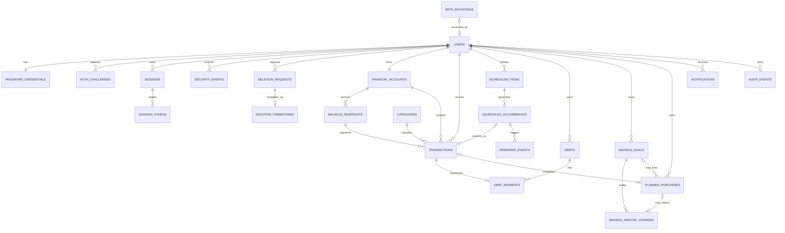

# KFin Database Specification

**Status:** Draft conceptual/logical model — Issue #1 correction model proposed; approval required<br>
**Database:** Proposed PostgreSQL<br>
**Decision baseline:** OQ-01 through OQ-19 recorded; Round 3 leaves all affected physical, concurrency, isolation, and legal-lifecycle choices open

This document defines an intended model and invariants, not executable schema or migrations. Names may be refined during reviewed physical design, but financial meaning and ownership constraints must not be weakened silently.

## 1. Data principles

1. Every private domain row is owned directly by a `user_id`, even when ownership could be inferred through a parent.
2. Authenticated identity comes from the validated server session, never a request body/path user identifier.
3. Relationships between private rows must prove same-user ownership, preferably with composite foreign keys.
4. Balance snapshots, current-impact transactions, historical-only transactions, scheduled money, debt state, and manual savings-goal amounts are separate concepts.
5. Amounts are exact integer minor units; rates use exact decimal/integer scale; binary floating point is forbidden.
6. Database constraints enforce invariants in addition to application validation.
7. Security and financial changes are auditable, but logs/audit storage minimize secret and sensitive payload.
8. Migrations are versioned, forward-reviewed, tested on realistic data, and coupled to restore/rollback plans.
9. Derived dashboard values are reproducible from the latest balance snapshot, its current-impact segment, scheduled occurrences, and manual goal values; caches/materializations are not source of truth.
10. Account deletion has a 7-day pending period followed by active-data purge. Maximum baselines are 90-day backups, 90-day application logs, and 24-month minimized security/audit evidence, subject to Vietnamese legal/privacy reduction.

## 2. Conventions

| Concern | Convention |
|---|---|
| Primary key | Random opaque UUID generated server-side or by approved database function |
| Ownership | `user_id UUID NOT NULL`; unique `(user_id, id)` supports composite references |
| Instants | `TIMESTAMPTZ`, stored/compared in UTC |
| Financial/due date | PostgreSQL `DATE`, interpreted in stored user/schedule IANA timezone |
| Currency | ISO 4217 uppercase 3-character code; one user base currency in MVP |
| Money | `BIGINT` minor units; positive magnitude plus explicit direction/kind; checked upper bound |
| Rates | Exact `NUMERIC` with bounded precision/scale or scaled integer; no float |
| Status | constrained text/check table rather than application-only strings |
| Concurrency | `version INTEGER NOT NULL DEFAULT 1` where user edits can conflict |
| Archival | explicit `archived_at`; posted financial correction uses proposed void/supersede behavior |
| Metadata | `created_at`, `updated_at` where meaningful; actor/correlation in separate audit record |
| Email | retain display email plus canonical normalized email with uniqueness |
| Free text | bounded length; never placed in logs/search index by default |

`BIGINT` values must be serialized through the API without JavaScript precision loss, preferably as decimal strings in the public contract.

## 3. High-level relationship model



The diagram omits operational tables and several same-user composite links for readability.

## 4. Identity and authentication tables

### 4.1 `users`

Purpose: account identity and user-level financial/locale context.

Key fields:

- `id UUID PK`
- `email TEXT NOT NULL` — presentation value
- `email_normalized TEXT NOT NULL UNIQUE`
- `email_verified_at TIMESTAMPTZ NULL`
- `display_name TEXT NULL` with length limit
- `locale TEXT NOT NULL`
- `timezone TEXT NOT NULL` — validated IANA name
- `base_currency CHAR(3) NOT NULL`
- `status TEXT NOT NULL` — `pending_verification | active | locked | disabled | deletion_pending` subject to retention policy
- `created_at`, `updated_at`, `disabled_at`, `deletion_requested_at`
- `version`

Constraints:

- Full application access requires `active` + verified email.
- Changing base currency after financial data exists is rejected in MVP unless a separately specified migration exists.
- Email is not used as a foreign key.

### 4.2 `beta_invitations`

Required for every Private Beta registration.

- `id UUID PK`, `code_digest BYTEA UNIQUE`
- `invited_email_normalized NULL` for optional email binding
- `status` — `active | consumed | expired | revoked`
- `expires_at`, `consumed_at`, `consumed_by_user_id NULL`
- `created_by_operator_id`, `created_at`, `revoked_at`

Rules:

- Generate high-entropy single-use code material and store only its purpose-bound digest.
- Code validation, pending user creation, and invitation consumption are atomic.
- Expired/consumed/revoked/other-email behavior must remain generic externally.
- Invitation provisioning is operator-audited; an admin UI is not required by the schema.
- An email match can constrain an invitation but can never grant admission by itself. No server-side email-allowlist table or bypass is an MVP registration mechanism.

### 4.3 `password_credentials`

- `user_id UUID PK/FK`
- `password_hash TEXT NOT NULL` — encoded Argon2id record including parameters/salt
- `password_changed_at TIMESTAMPTZ NOT NULL`
- `hash_policy_version SMALLINT NOT NULL`

No plaintext, reversible password, password hint, or password history value is stored. A successful login may rehash when policy version is old.

### 4.4 `auth_challenges`

One purpose-bound model for email verification and password reset; magic login is not in scope.

- `id`, `user_id` nullable only for deliberately generic workflows, `purpose`
- `target_digest` or normalized target reference as required without creating enumeration leakage
- `secret_digest BYTEA NOT NULL`
- `issued_at`, `expires_at`, `consumed_at`, `superseded_at`
- `attempt_count`, `max_attempts`
- `request_context_digest`/safe metadata where approved
- `last_delivery_attempt_at`, `last_delivery_status`, and a sanitized provider message reference where needed

Constraints:

- Active challenge cannot be used after expiry, consumption, supersession, or attempts exhausted.
- Digest is purpose/domain separated and protected against offline guessing with a server secret because numeric OTP entropy is low.
- Resend policy must make which challenge remains active unambiguous.
- The plaintext OTP/reset secret exists only in request-process memory long enough for immediate provider submission under the proposed design. It is not placed in the ordinary outbox because a digest cannot be reversed and queued plaintext would violate secret-storage requirements.

### 4.5 `sessions`

Represents one recognizable device/browser login and revocation boundary.

- `id`, `user_id`, `family_id`
- `client_type` — `web | pwa | native` (native reserved for future)
- `created_at`, `last_seen_at`
- `idle_expires_at`, `absolute_expires_at`
- `revoked_at`, `revocation_reason`
- `device_label`/parsed agent summary, bounded
- privacy-approved network context such as truncated IP or one-way prefix digest
- `version`

### 4.6 `session_tokens`

Supports digest-only storage and race-safe rotation/replay handling.

- `id`, `session_id`, `token_digest BYTEA UNIQUE`
- `generation INTEGER`
- `issued_at`, `expires_at`, `retired_at`
- `grace_expires_at` nullable
- `replayed_at` nullable

Only current (and a tightly bounded previous grace token, if approved) can authenticate. A retired token replay outside policy revokes the family/session and creates a security event.

### 4.7 `security_events`

User-visible and operator-reviewable security history.

- `id`, `user_id` nullable where account is unknown
- `event_type`, `outcome`, `occurred_at`
- `session_id` nullable, `correlation_id`
- privacy-approved client/network summary
- `metadata JSONB` limited to an allowlisted schema and never containing secrets/financial payload

Examples: registration requested, email verified, login success/failure summary, password changed/reset, session revoked, suspicious token replay. Maximum baseline retention is 24 months, subject to legal reduction and post-deletion minimization/pseudonymization.

### 4.8 `deletion_requests`

- `id`, `user_id`
- `status` — `pending | cancelled | processing | completed | failed`
- `requested_at`, `cancel_before`, `cancelled_at`, `processing_started_at`, `completed_at`
- identity-verification/recent-auth reference without secret material
- approved `request_channel`, `correlation_id`, `failure_code NULL`

Rules:

- `cancel_before = requested_at + 7 days` under the accepted baseline.
- Only one unresolved request per user.
- Processing is idempotent and follows an approved table/provider deletion map.
- A minimum non-identifying deletion tombstone survives active purge long enough to prevent restored backups from reactivating deleted data; its retention/legal basis must be approved.

### 4.9 `deletion_tombstones` / restore-exclusion register

Purpose: prevent an older application/database restore point from resurrecting a user purged after that backup was taken.

Minimum logical fields:

- `id UUID PK`, opaque `purge_operation_id UNIQUE`
- `subject_digest BYTEA UNIQUE` — purpose-separated keyed digest of the original immutable user UUID; no email/name/raw user ID
- `digest_key_version`
- `purge_completed_at`, `created_at`, `expires_at`
- minimum non-sensitive deletion-map/version and outcome code where legally approved

Rules:

- The register must be available from a protected source that is operationally independent of the application restore point being activated; a row only inside the same old backup is insufficient.
- Before activation, restore tooling computes subject digests for restored users with the controlled tombstone key, removes/suppresses every match, and records count-only evidence.
- Tombstones remain until every backup/restore point capable of containing the subject has expired, plus any legally approved verification margin; they must not be silently retained forever.
- Digest key access, backup, rotation, destruction, and break-glass use require a reviewed procedure. The register has stricter write/delete privileges than the runtime application.
- Exact storage mechanism, legal basis, pseudonymization strength, and expiry are physical-design/legal blockers; raw direct identifiers are prohibited by default.

## 5. Reference and account tables

### 5.1 `categories`

- `id`
- `owner_user_id NULL` for system category; non-null reserved for future customization
- `code`, localized message key, `transaction_kind`
- default `expense_class` nullable
- `active`, display order

MVP ships reviewed system categories. A user cannot mutate global rows. Custom categories remain out of scope even though the schema can evolve to them.

### 5.2 `financial_accounts`

- `id`, `user_id UNIQUE`
- `name` — system/default aggregate label; not an exposed account taxonomy
- `account_type` fixed to `aggregate_liquid` in MVP
- `currency CHAR(3)` equal to user base currency
- `created_at`, `updated_at`, `version`

Rules:

- Exactly one account may exist per user in MVP; account picker, archive, transfer, and multiple account types are absent.
- Currency cannot change after the first snapshot/financial record.
- Negative current balance is valid and must not be silently clamped.
- Future multi-account support requires a migration that deliberately removes the one-user uniqueness and specifies transfers plus any bank/account-statement reconciliation workflow.

### 5.3 `balance_snapshots`

Purpose: immutable authoritative anchors for current-balance segments.

- `id`, `user_id`, `account_id`
- `amount_minor BIGINT NOT NULL` — signed snapshot amount
- `currency CHAR(3) NOT NULL`
- `effective_at TIMESTAMPTZ NOT NULL`
- `effective_local_date DATE NOT NULL`, `timezone TEXT NOT NULL`
- `reason` — `onboarding | manual_balance_update | recovery_correction`
- bounded `note NULL`
- `created_at`, `created_by_user_id NULL`, `created_by_operator_id NULL`, `correlation_id`; exactly one approved actor reference is present

Rules:

- `(user_id, account_id)` must identify the user’s one account and currency.
- Snapshots are immutable; correction creates a new snapshot with explicit reason rather than overwriting.
- `(account_id, effective_at)` is unique; latest snapshot is selected deterministically by `effective_at DESC`.
- Creating a post-onboarding snapshot begins a new balance segment and does not mutate old transactions; this is a manual known-balance update, not a bank/account-statement reconciliation workflow.
- A new user-created snapshot must be strictly later than the current latest snapshot under the approved serialized comparison; backdated and future-dated snapshot insertion is forbidden.
- A recovery-created snapshot requires elevated operational procedure and audit.

## 6. Posted transactions

### 6.1 `transactions`

Purpose: source of truth for actual cash inflow/outflow.

- `id`, `user_id`, `account_id`, `balance_snapshot_id`
- `kind` — `income | expense`
- `amount_minor BIGINT NOT NULL CHECK (amount_minor > 0)`
- `currency CHAR(3) NOT NULL`
- `occurred_on DATE NOT NULL`
- `balance_effect` — `current | historical`
- `already_included_in_snapshot BOOLEAN NOT NULL` consistent with balance effect
- `category_id`
- `expense_class NULL` — `essential_fixed | essential_variable | daily`; null for income unless future specification says otherwise
- `is_unexpected BOOLEAN NOT NULL DEFAULT FALSE` — orthogonal to expense class
- `note TEXT NULL` with bounded length
- `status` — `posted | voided`
- `voided_at`, `void_reason` nullable
- `supersedes_transaction_id` nullable for a reviewed correction model
- `created_at`, `updated_at`, `version`

Invariants:

- `(user_id, account_id, balance_snapshot_id)` resolves to one same-user account/snapshot segment.
- Currency equals account/user/snapshot currency.
- `historical` requires `already_included_in_snapshot = true`; it participates in period/category reporting but never current-balance arithmetic.
- `current` means the transaction was a delta after its attached anchor and contributes to current balance only while that anchor is latest. A newer snapshot does not rewrite this immutable meaning; UI/reporting then identifies it as prior-segment evidence.
- `occurred_on` before the latest snapshot’s `effective_local_date` requires `historical`; a later local date requires `current`; the same local date requires an explicit server-validated `already_included_in_snapshot` choice.
- A posted actual transaction cannot have a future `occurred_on` in the user’s stored timezone; future expectations belong to schedules/plans.
- Income cannot have an expense class and must set `is_unexpected = false`.
- An expense may retain its essential/daily class while independently being unexpected.
- Voided transactions do not affect balance or period aggregates.
- Under proposed `snapshot_correction.v1`, every supported correction atomically marks the posted terminal source `voided` and creates exactly one posted replacement with `supersedes_transaction_id = source.id`. Standalone void creates no replacement. In-place correction, successor branching, correction of a non-terminal source, and more than one posted terminal row are prohibited.
- Replacement `user_id`, `account_id`, currency, kind, `balance_snapshot_id`, `balance_effect`, and inclusion meaning equal the source. A request/date requiring another segment/effect is rejected without mutation. Closed-segment correction/void has zero current-balance effect.
- Schedule-only supported correction atomically transfers `scheduled_occurrences.confirmed_transaction_id` to the replacement while retaining audit linkage. Generic debt/planned-purchase correction and linked standalone void follow the explicit reject/delegate matrix in the product correction specification; no link is detached or partially updated.
- Correction/void preserves actor/reason/time, old/new values, anchor/effect context, owning-domain transition, versions, correlation, idempotency request digest/result, and consequence preview under `FIN-SNAP-INV-08`.
- Link tables/columns below prevent one posted transaction from satisfying multiple incompatible domain actions.

#### 6.1.1 Proposed correction-chain constraints

The reviewed physical design MUST enforce or transactionally prove:

- `supersedes_transaction_id` references a same-user, same-account source and is unique when present, so one source cannot branch;
- source and replacement cannot be the same row;
- a correction source is `posted` and terminal at validation, then becomes `voided` in the same transaction that creates the replacement;
- immutable authority fields listed above match across source/replacement;
- a standalone void and correction cannot both win for one source;
- no hard delete removes a transaction or correction-chain member;
- one idempotency result identifies the complete source/replacement/link/audit outcome; and
- report/current-balance queries count only `posted` rows and therefore one terminal effect.

The exact PostgreSQL constraint/index/locking combination remains physical design under `SPEC-FIN-02`; these observable integrity results do not.

### 6.2 Balance and monthly calculation

For latest snapshot `S`:

```text
current balance
= S.amount_minor
+ sum(posted current income where balance_snapshot_id = S.id)
- sum(posted current expense where balance_snapshot_id = S.id)
```

Rules:

- `historical` transactions never enter current-balance arithmetic, even if created after `S`.
- Transactions attached to an older snapshot segment no longer enter current balance after a newer snapshot becomes authoritative; the newer user-entered amount supersedes the old segment as the current anchor.
- Monthly income/outflow includes every posted terminal transaction by `occurred_on`, both `current` and visibly labelled `historical`, and excludes voided chain members. If correction changes month/category, reports remove the source effect, add the replacement effect, show an amended marker, and retain chain drill-down.
- Latest-segment current correction contributes replacement minus source exactly once; latest historical and every closed-segment correction/void contribute zero to current balance. A closed-segment source originally marked `current` is not replayed after correction.
- Current balance therefore cannot be reconstructed from an unbounded all-history transaction sum across snapshot boundaries. Reporting APIs must expose the snapshot anchor and components.
- Use checked integer arithmetic and a database view/query; do not maintain a mutable balance cache in MVP.
- Snapshot creation and correction/void share a logical per-account serialization boundary: exactly one request commits against one previewed state and the loser receives a stable stale-state conflict with no auto-reanchor/retry. `SPEC-FIN-02` remains a blocker for the exact PostgreSQL lock/isolation/version primitive and evidence, not for this external outcome.
- These rules implement `FIN-SNAP-INV-01` through `FIN-SNAP-INV-10`; scenarios A–J in the test strategy are mandatory acceptance evidence.

### 6.3 Safe-to-spend query contract

The database/reporting query implements formula version `safe_to_spend.v1`, `PRD-DASH-07`, and `FIN-STS-INV-01` through `FIN-STS-INV-07` without a mutable source-of-truth cache:

```text
safe_to_spend
= latest-snapshot-segment current balance
- sum(unpaid outgoing occurrences where due_on <= current user-local month-end)
- sum(current_amount_minor of active savings goals)
```

Unresolved overdue outgoings are included. Scheduled/projected income, paid/confirmed/skipped/cancelled outgoings, archived goals, historical-only transactions, and prior snapshot segments are excluded from their respective terms. Confirmation moves one outgoing from the unpaid term to a posted current-balance effect atomically, preventing double subtraction. The query returns its formula version, evaluation instant, user timezone, local month-end, snapshot ID/as-of time, signed result, and drill-down identifiers. Test cases `STS-01` through `STS-15` are mandatory.

## 7. Schedules and occurrences

### 7.1 `scheduled_items`

Represents a planned series, not actual money.

- `id`, `user_id`
- `kind` — `income | essential_expense | debt_payment | other_obligation`
- `title`
- `expected_amount_minor`, `currency`
- `account_id` nullable/default for confirmation
- `category_id` nullable
- `debt_id` nullable and same-user when kind is debt payment
- recurrence fields: `frequency`, `interval`, `day_of_week`/`day_of_month` as applicable
- `month_day_policy` where applicable; fixed to `last_day_if_missing` in MVP
- `start_on`, `end_on` nullable
- `timezone`
- `confirmation_policy` fixed to `explicit` in MVP
- `active`, `created_at`, `updated_at`, `version`

Avoid opaque recurrence JSON for core supported cadences. MVP supports one-off plus interval-based weekly, monthly, and yearly schedules; a requested monthly day missing from a short month resolves to that month’s last local calendar day. Daily recurrence and arbitrary RFC 5545 rules are excluded.

### 7.2 `scheduled_occurrences`

- `id`, `user_id`, `scheduled_item_id`
- `due_on DATE`
- `expected_amount_minor`, `currency` — snapshot so later schedule edits do not rewrite history
- `state` — `scheduled | confirmed | skipped | cancelled`
- `confirmed_transaction_id` nullable unique
- `confirmed_at`, `skipped_at`, `skip_reason`, `cancelled_at`
- `created_at`, `updated_at`, `version`

Constraints:

- Unique `(scheduled_item_id, due_on)` for supported once-per-day recurrence.
- Confirmed requires exactly one same-user posted transaction with compatible direction.
- Scheduled/skipped/cancelled has no confirmed transaction.
- `due_today` and `overdue` are derived presentation states; they are not payment states and should not require a midnight mass update.
- Generator upserts a bounded future window and is idempotent.

One-off obligations may be represented by a non-recurring scheduled item with one occurrence, avoiding a second competing obligation model.

## 8. Debt tables

### 8.1 `debts`

- `id`, `user_id`, `name`
- `original_principal_minor`, `currency`
- `current_outstanding_minor`, `outstanding_as_of DATE`
- `interest_rate NUMERIC NULL`, `interest_rate_basis` nullable/fixed to `annual_percentage` when a rate is supplied
- `interest_rate_as_of DATE NULL`, bounded `interest_rate_source TEXT NULL` — informational provenance paired consistently with a supplied rate
- `interest_method TEXT NULL` — informational/unknown in MVP; no calculation implied
- `expected_payment_minor`, `payment_frequency`
- `status` — `active | paid_off | archived`
- `created_at`, `updated_at`, `version`

The current outstanding amount is explicitly user-maintained/lender-reported. Its as-of date cannot be in the user’s future. MVP has no authoritative interest-accrual, principal-allocation, fee-allocation, amortization, payoff, or lender-balance engine. Updating outstanding requires user-supplied principal, an explicit new lender-reported value, or a separate explicit balance adjustment; KFin never reconstructs any of them.

### 8.2 `debt_payments`

- `id`, `user_id`, `debt_id`
- `transaction_id UNIQUE` — posted expense cash outflow
- `scheduled_occurrence_id NULL UNIQUE`
- `total_amount_minor`
- `principal_amount_minor NULL`
- `interest_amount_minor NULL`
- `fee_amount_minor NULL`
- `split_status` — `none | partial | complete`
- `paid_on`
- `outstanding_after_minor NULL`, `outstanding_as_of NULL`
- `status` — `posted | voided`; `voided_at`, `supersedes_debt_payment_id NULL`
- `created_at`

#### Debt-payment and correction invariants

- **DEBT-INV-01 — Separate facts:** the posted expense is authoritative only for cash outflow. A debt-payment link/split is a user statement about that outflow and is not lender-verified amortization.
- **DEBT-INV-02 — No inference engine:** KFin never derives principal, interest, fee, accrued interest, amortization, payoff date, or lender outstanding from rate, elapsed time, expected payment, unclassified remainder, or total paid.
- **DEBT-INV-03 — Explicit split:** provided split components are non-negative and their sum cannot exceed total. `complete` requires explicit principal + interest + fee (including explicit zeroes) to equal total; `partial` preserves a visible unclassified remainder; `none` classifies nothing.
- **DEBT-INV-04 — Outstanding authority:** only explicit principal supplied by the user or an explicit new lender-reported balance/as-of date may change outstanding. These are mutually exclusive outstanding-update modes for one payment; the system never both subtracts principal and applies a reported balance. With neither, the prior outstanding amount and as-of date remain exactly unchanged.
- **DEBT-INV-05 — Preserved correction:** a supported correction atomically voids the old payment/transaction as evidence and creates linked replacement records; actor, reason, time, idempotency, ownership, currency, occurrence link, and old/new effects are retained.
- **DEBT-INV-06 — Safe deterministic boundary:** when no later outstanding-affecting payment/adjustment exists and the pre-payment state plus all old/replacement effects are explicit, a correction/void may restore the explicit pre-payment outstanding and apply only replacement explicit principal or replacement lender-reported balance. Omitted components remain unknown and are never redistributed.
- **DEBT-INV-07 — Cash-only correction:** if the old and replacement payment have no explicit principal or lender-balance effect, correcting total/date/classification changes the posted cash record and history only; debt outstanding/as-of remain unchanged.
- **DEBT-INV-08 — Unsafe historical boundary:** if a later payment/adjustment exists, an as-of reorder occurs, required pre-state is missing, or the result would require inferred principal/interest/fee/outstanding, automatic outstanding recomputation is forbidden. The exact historical correction/rebase/rejection workflow is **BLOCKER `SPEC-DEBT-01`**; an implementer may not select one.

All rows/currency/user ownership must agree. The debt correction matrix in the test strategy is mandatory evidence after `SPEC-DEBT-01` is resolved.

### 8.3 `debt_balance_adjustments`

- `id`, `user_id`, `debt_id`
- `previous_amount_minor`, `new_amount_minor`
- `as_of DATE`, bounded `reason`
- `created_at`, approved actor reference, `correlation_id`

Adjustment rows are immutable. This preserves explicit reconciliation with a lender statement rather than disguising unexplained difference as interest. Creating payment/adjustment and updating `debts.current_outstanding_minor` is atomic and version checked.

## 9. Savings tables

MVP stores a manual current amount, not a contribution/withdrawal ledger.

### 9.1 `savings_goals`

- `id`, `user_id`, `name`
- `target_amount_minor`, `current_amount_minor`, `currency`
- `current_amount_as_of DATE NOT NULL`
- `target_date NULL`
- `planned_contribution_minor NULL`
- `contribution_frequency NULL`
- `status` — `active | archived`
- `created_at`, `updated_at`, `version`

Rules:

- Current/target amounts are non-negative and use the user base currency; `current_amount_as_of` cannot be in the user’s future.
- `Achieved`/over-target is derived from current versus target amount and does not silently archive the goal or remove its reserve.
- Current amount is an absolute user-maintained reserve estimate; it does not alter the aggregate account or monthly income/outflow.
- Safe-to-spend subtracts `current_amount_minor` for active goals only.
- Updating current amount uses optimistic versioning and must create one old/new audit row in the same transaction.

### 9.2 `savings_amount_changes`

Purpose: correction/audit evidence, not a semantic cash ledger.

- `id`, `user_id`, `savings_goal_id`
- `previous_amount_minor`, `new_amount_minor`
- `as_of DATE`
- `source` — `initial | manual_update | planned_purchase_use | recovery_correction`
- `planned_purchase_id NULL UNIQUE` — required and same-user only for `planned_purchase_use`; one completion has at most one goal-change row
- bounded `reason NULL`
- `created_at`, `actor_user_id NULL`, `actor_operator_id NULL`, `correlation_id`; exactly one approved actor reference is present

Rules:

- A row is immutable and created atomically with the scalar goal update.
- It is never included in account balance, income, expense, or transaction totals.
- It must not be labelled as contribution/withdrawal history in the UI.
- For planned-purchase use, decrease is non-negative and no greater than both prior current amount and actual purchase amount.

## 10. Planned purchases

### 10.1 `planned_purchases`

- `id`, `user_id`
- `name`
- `target_price_minor`, `currency`
- `target_date NULL`
- `savings_goal_id NULL` with same-user composite reference
- `status` — `planned | purchased | cancelled | archived`
- `completed_transaction_id NULL UNIQUE` with same-user posted expense reference
- `completed_at`, `created_at`, `updated_at`, `version`

Rules:

- Planned has no completed transaction.
- Purchased requires a linked posted expense and completion timestamp.
- Linking a goal does not move money.
- Purchase completion may atomically decrease a linked goal’s scalar current amount by a user-confirmed value (including zero) and create one `planned_purchase_use` old/new audit row. The decrease cannot exceed purchase amount or prior goal current amount.
- Idempotency/unique linkage prevents duplicate expense creation or repeated goal decrease.
- Completing/cancelling/archiving a purchase does not auto-zero, archive, or delete a goal.

## 11. Notifications and jobs

MVP has no user-configurable reminder-rule/channel table. The four fixed approved stages derive directly for eligible outgoing obligations; scheduled income has no fixed-stage notification requirement. The worker evaluates them at 09:00 in the occurrence/user IANA timezone.

### 11.1 `reminder_events`

- `id`, `user_id`, `scheduled_occurrence_id`
- `stage` — `seven_days | three_days | due_today | first_overdue`
- `scheduled_for TIMESTAMPTZ`, local timezone/date metadata
- `status` — `pending | created | cancelled | failed | dead`
- `attempt_count`, `last_attempt_at`
- `deduplication_key UNIQUE`
- `notification_id NULL UNIQUE`
- `created_at`, `completed_at`

Rules:

- Only an eligible outgoing-obligation occurrence may have a fixed-stage reminder event; scheduled-income occurrences are excluded.
- Deduplication key uniquely represents occurrence + stage; worker retries, downtime, timezone changes, and app lifecycle cannot create duplicates.
- `first_overdue` is generated once and never repeats while the occurrence remains overdue.
- Confirmed/skipped/cancelled occurrence cancels unresolved reminder events; the worker rechecks current version/state before insertion.
- Reminder event or notification state never changes occurrence payment state.
- If downtime, late creation, or timezone change makes multiple stages elapsed, one recovery evaluation may create at most one event for that occurrence. Stage selection, non-selected-stage recording, and recovery-window semantics remain **BLOCKER `SPEC-REM-01`**.
- App close/reopen/delayed return only affects when persisted notifications are viewed; it does not enqueue, replay, or regenerate reminder events.
- These rules implement `REM-INV-01` through `REM-INV-10` in ADR-008.

### 11.2 `notifications`

- `id`, `user_id`
- `type`, `resource_type`, `resource_id` (validated by application; polymorphic reference cannot replace authorization)
- safe message-key + minimal parameters; avoid duplicating sensitive full payload
- `deduplication_key NULL` — required for cash-flow warnings and any non-reminder logical notification that can be retried; unique with `user_id` when present
- `created_at`, `read_at`, `dismissed_at`

### 11.3 `outbox_jobs`

- `id`, `topic`, `payload JSONB` constrained/versioned to minimum identifiers
- `deduplication_key UNIQUE`
- `available_at`, `lease_until`, `attempt_count`, `max_attempts`
- `status`, `last_error_code`, `created_at`, `completed_at`

Outbox insertion occurs in the domain transaction. Payload must not contain OTP/reset/session plaintext. Ordinary notifications reference protected records or minimum non-secret template input. Secret-bearing OTP/reset messages use the immediate ephemeral-memory delivery path proposed in ADR-002/ADR-008; an asynchronous encrypted-envelope design would require a separate reviewed decision.

## 12. Integrity and operational tables

### 12.1 `idempotency_keys`

- `id`, `user_id`, `operation`, `key_digest`
- canonical request digest
- response status and bounded response reference/result
- `created_at`, `expires_at`
- unique `(user_id, operation, key_digest)`

A reused key with a different request digest returns a deterministic conflict. Retention must cover retry windows and is not permanent.

### 12.2 `audit_events`

- `id`, `user_id`, `actor_user_id`/operator identifier nullable
- `action`, `resource_type`, `resource_id`
- `outcome`, `occurred_at`, `correlation_id`
- `changes JSONB` only for allowlisted necessary fields; redact notes and sensitive values by default
- tamper-evidence approach to be selected; database permissions prevent application update/delete under normal role

Security audit is not a substitute for financial source history. Operator access events must be distinguishable from user actions.

### 12.3 `rate_limit_counters` (optional application layer)

Cloudflare provides coarse limits; account-aware controls may use bounded PostgreSQL counters/advisory locking or a provider service. If PostgreSQL is used:

- store digested subject keys, bucket start, count, expiry;
- partition/prune aggressively;
- never store plaintext passwords/tokens or create an email-enumeration side channel;
- design writes to resist turning abuse protection into database exhaustion.

The exact mechanism must be validated in an implementation spike.

## 13. Tenant isolation

Required layers:

1. Session middleware derives `user_id`; handlers do not accept ownership fields.
2. Every repository method requires an authenticated owner context.
3. Queries include owner scope, including update/delete predicates.
4. Private parent-child relationships use composite `(user_id, id)` constraints.
5. API returns the same unavailable behavior for absent/unowned IDs.
6. Automated BOLA tests attempt cross-user access for every resource and verb.
7. Database application role has least privilege; migrations use a separate role.
8. PostgreSQL Row Level Security is proposed as defense in depth. If accepted, each request transaction sets a trusted local user context; policies enforce it, app role cannot bypass it, pooled connections reset safely, and worker/operator pathways have separately tested policies.

RLS is not a reason to omit application authorization. If RLS is rejected, the ADR/security review must document compensating controls and rationale before beta.

## 14. Key indexes

Physical design must validate query plans, but expected indexes include:

- unique `balance_snapshots (account_id, effective_at)` plus `(user_id, account_id, effective_at DESC)` for latest-anchor lookup;
- `transactions (user_id, occurred_on DESC, id DESC)` for Activity plus filtered `(user_id, balance_snapshot_id, balance_effect, status)` for current-balance calculation;
- `scheduled_occurrences (user_id, due_on, state)` and unique `(scheduled_item_id, due_on)`;
- `debts (user_id, status)`;
- `savings_goals (user_id, status)` and `savings_amount_changes (user_id, savings_goal_id, created_at DESC)`;
- `planned_purchases (user_id, status, target_date)`;
- `sessions (user_id, revoked_at, absolute_expires_at)` and unique session token digest;
- `auth_challenges` on active expiry/user/purpose without indexing plaintext secrets;
- `reminder_events (status, scheduled_for)` for worker claims plus dedup unique;
- `notifications (user_id, created_at DESC)` plus nullable logical-dedup uniqueness;
- `outbox_jobs (status, available_at)` plus dedup unique;
- `security_events/audit_events (user_id, occurred_at DESC)`;
- `deletion_requests (status, cancel_before)` plus one-unresolved-per-user uniqueness;
- unique deletion-tombstone subject digest plus expiry index in the independent restore-exclusion register;
- idempotency unique and expiry indexes.

Indexes containing sensitive values receive the same backup/access protections as tables. Avoid indexing unrestricted notes.

## 15. Retention, deletion, and privacy

Accepted product baseline, subject to Vietnamese legal/privacy review:

- deletion request remains cancellable for 7 days;
- after the deadline, active identity/financial data is purged or irreversibly anonymized according to an approved table/provider deletion map;
- encrypted backup retention has a 90-day maximum;
- application log retention has a 90-day maximum;
- minimized security/audit evidence has a 24-month maximum;
- secrets/challenges/idempotency/rate counters use much shorter purpose-specific expiry;
- provider records cannot exceed the approved purpose/contract period.

Required properties:

- legal review may shorten, but not silently extend, the baseline periods;
- deletion jobs are auditable, idempotent, resumable, and include third-party data where contractually possible;
- direct identity and financial payload are not retained merely because security evidence has a longer period;
- retained security/audit rows after purge are minimized/pseudonymized under approved legal basis;
- backups age out automatically rather than being surgically edited unsafely;
- the current independent restore-exclusion register is obtained and deletion tombstones are reapplied to any restore before user data becomes active;
- legal hold/incident exceptions require documented authority, scope, access, and expiry;
- production data is never copied to development/test;
- support/operator reads are authorized, logged, and minimal.

Private Beta is blocked until the deletion map, request channel, cancellation authentication, retained fields, provider behavior, and legal basis are approved.

## 16. Migration strategy

- Sequential, immutable migration files after merge.
- Migration role separate from runtime role.
- Test every migration from the last production schema with representative volume.
- Prefer expand → deploy compatible code → backfill in bounded batches → verify → contract later.
- Avoid long table locks; set lock/statement timeouts and rehearse risky operations.
- Backfill jobs are resumable and emit counts, not sensitive row payloads.
- Destructive migrations require approved backup/restore and rollback/forward plan.
- Release health checks verify schema compatibility.

## 17. Backup and recovery

Baseline pending provider/legal confirmation:

- Managed daily encrypted backups and point-in-time recovery where available, with no restore point retained beyond 90 days.
- Backup access limited to designated operators and audited.
- Cross-account/region copy only if residency/legal policy allows.
- Monthly restore drill during beta preparation/early beta; at least quarterly after stability, subject to approved RPO/RTO.
- Restore into an isolated environment, obtain the current independently protected restore-exclusion register, reapply deletion tombstones, validate schema/constraints/counts/snapshot balances/sample reports, and execute application smoke tests before any activation.
- Securely destroy the restored copy afterward.
- Evidence records backup ID/time, restore duration, checks, issues, and approver—never exported user financial data.

## 18. Reconciliation checks

Automated or operator-safe checks should detect:

- linked occurrence direction/currency mismatches;
- confirmed occurrence without exactly one posted transaction;
- purchased item without posted expense;
- debt payment totals/splits or outstanding history mismatch;
- savings scalar value without exactly one corresponding old/new change record for each update;
- planned-purchase goal decrease outside allowed bounds or repeated by duplicate completion;
- transaction/snapshot user, currency, segment, or balance-effect mismatch;
- current-balance query including historical/old-segment records;
- orphaned same-user links;
- duplicate logical occurrences/reminder stages/jobs;
- cross-currency aggregate attempts;
- balance arithmetic overflow;
- completed deletion missing required purge checkpoints/tombstone;
- outbox/domain commits missing required delivery intent.

Checks emit identifiers/counts and safe error codes, not notes or complete financial records in logs.

## 19. Open physical-design decisions

Product meaning is set by OQ-01 through OQ-19. Round 3 makes each affected physical decision reviewable without selecting it:

| Blocker | Exact data decision | Immutable data constraints | Required evidence / acceptance condition | Accountable owner | Status |
|---|---|---|---|---|---|
| `SPEC-AUTH-02` | Invitation/challenge/session values; keyed-digest construction; challenge supersession; rotation/grace/replay and last-seen write behavior | No plaintext reusable secret; generic responses; reset revokes all sessions | Benchmark/threat/replay/provider evidence; Security + Product approve every value and all auth/session documents agree | Security Owner | OPEN — decision ready |
| `SPEC-FIN-01` | Approve proposed `snapshot_correction.v1`: void + replacement, immutable anchor/effect, cross-segment rejection, exact link/report/audit/preview/idempotent/stale outcomes | No in-place erasure, double effect, silent segment movement, or rewrite of current balance from closed history | Issue #1 PR review; H–J and `FIN-COR-01`–`10` are reproducible; Product + Financial Integrity + Data + Security approve | Product Owner | OPEN — approval/evidence ready |
| `SPEC-FIN-02` | Choose the PostgreSQL per-account linearization/lock/isolation/version primitive and transaction ordering that enforces the specified winner/stale-loser contract | One latest segment; deterministic attachment; no silent re-anchor or duplicate effect | PostgreSQL race/deadlock/timeout evidence; scenario J race branches pass; accepted ADR amendment/new ADR | Data Owner | OPEN — decision ready |
| `SPEC-DEBT-01` | Explicit-fact replay or mandatory fresh lender-reported outstanding for corrections with later events; date reorder/void/partial-failure behavior | No inferred component, amortization, payoff, or outstanding; unsafe path unavailable | DCT-08/09 and multi-event results fixed; Product + Financial Integrity + Data approve | Product Owner | OPEN — decision ready |
| `SPEC-SCH-01` | 29-February policy; interval/end/horizon/batch/active-series limits; split-point and occurrence/future edit behavior | Monthly missing-day fallback and supported cadence stay fixed; generated rows idempotent; history preserved | Boundary/load/edit-race tests; Product + Data + Architecture approve all fields and bounds | Product Owner | OPEN — decision ready |
| `SPEC-REM-01` | Catch-up stage-or-none precedence, recovery age, suppression status/reason, timezone/late-creation/state-race behavior | Occurrence + stage uniqueness; at most one catch-up; no burst or financial mutation | RCT-04–07 exact results plus outage/timezone/race proof; Product + Architecture + Operations + QA approve | Product Owner | OPEN — decision ready |
| `SPEC-SEC-01` | RLS table/action policies, trusted context, pool reset and special roles; or explicit compensating controls/risk | Application authorization, owner scope, composite ownership, least privilege and two-user tests remain mandatory | Every private table/action and pool/worker/operator path covered; residual risk signed if RLS omitted | Security Owner | OPEN — decision ready |
| `SPEC-DEL-01` | Complete table/provider disposition; retained pseudonymous fields; tombstone storage/key/expiry; purge/legal-hold/provider state | Seven-day cancel, idempotent purge, no reusable secret retention and no restored-account reactivation | Approved map/legal basis plus cancellation/purge race and restore-drill evidence | Privacy/Legal Owner | OPEN — decision ready |
| `SPEC-GOV-01` | Money/text/page/schedule/job/auth/retention bounds and database-version change authority | Framework defaults cannot become policy silently | Every bound has value, rationale, owner, user consequence and boundary test in governance register | Product Owner | OPEN — evidence/assignment ready |

`RC-PROV-01` separately retains PostgreSQL version/extensions/pooling/PITR selection until the Release Candidate provider gate. Full decision alternatives, co-approvers and binary criteria are in the [Round 3 report](../reviews/SPECIFICATION-REMEDIATION-ROUND-3.md).

No migration should be written until the logical model, privacy/legal constraints, and affected pre-implementation blockers are authorized with evidence. A migration or ORM default cannot be used to make one of these decisions implicitly.
