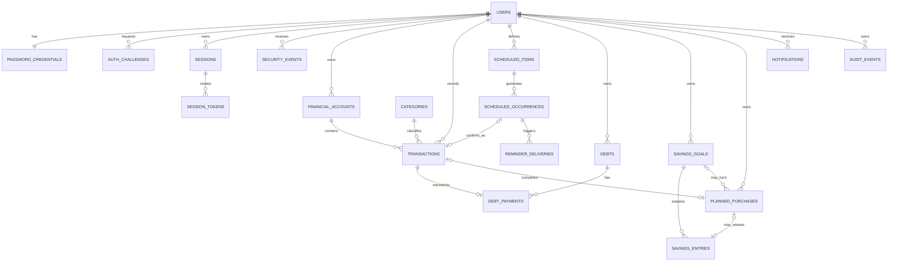

# KFin Database Specification

**Status:** Draft conceptual/logical model — review required<br>
**Database:** Proposed PostgreSQL<br>
**Important blockers:** OQ-02, OQ-03, OQ-04, OQ-07, OQ-08, OQ-10, OQ-13, OQ-14, OQ-15

This document defines an intended model and invariants, not executable schema or migrations. Names may be refined during reviewed physical design, but financial meaning and ownership constraints must not be weakened silently.

## 1. Data principles

1. Every private domain row is owned directly by a `user_id`, even when ownership could be inferred through a parent.
2. Authenticated identity comes from the validated server session, never a request body/path user identifier.
3. Relationships between private rows must prove same-user ownership, preferably with composite foreign keys.
4. Actual posted money, scheduled money, debt state, and virtual savings allocations are separate concepts.
5. Amounts are exact integer minor units; rates use exact decimal/integer scale; binary floating point is forbidden.
6. Database constraints enforce invariants in addition to application validation.
7. Security and financial changes are auditable, but logs/audit storage minimize secret and sensitive payload.
8. Migrations are versioned, forward-reviewed, tested on realistic data, and coupled to restore/rollback plans.
9. Derived dashboard values are reproducible from source records; caches/materializations are not source of truth.
10. Retention/deletion behavior remains blocked until OQ-10 has legal/product approval.

## 2. Conventions

| Concern | Convention |
|---|---|
| Primary key | Random opaque UUID generated server-side or by approved database function |
| Ownership | `user_id UUID NOT NULL`; unique `(user_id, id)` supports composite references |
| Instants | `TIMESTAMPTZ`, stored/compared in UTC |
| Financial/due date | PostgreSQL `DATE`, interpreted in stored user/schedule IANA timezone |
| Currency | ISO 4217 uppercase 3-character code; one user base currency in MVP |
| Money | `BIGINT` minor units; positive magnitude plus explicit direction/kind; checked upper bound |
| Rates | Exact `NUMERIC` with bounded precision/scale or scaled integer; no float |
| Status | constrained text/check table rather than application-only strings |
| Concurrency | `version INTEGER NOT NULL DEFAULT 1` where user edits can conflict |
| Archival | explicit `archived_at`; posted financial correction uses proposed void/supersede behavior |
| Metadata | `created_at`, `updated_at` where meaningful; actor/correlation in separate audit record |
| Email | retain display email plus canonical normalized email with uniqueness |
| Free text | bounded length; never placed in logs/search index by default |

`BIGINT` values must be serialized through the API without JavaScript precision loss, preferably as decimal strings in the public contract.

## 3. High-level relationship model



The diagram omits operational tables and several same-user composite links for readability.

## 4. Identity and authentication tables

### 4.1 `users`

Purpose: account identity and user-level financial/locale context.

Key fields:

- `id UUID PK`
- `email TEXT NOT NULL` — presentation value
- `email_normalized TEXT NOT NULL UNIQUE`
- `email_verified_at TIMESTAMPTZ NULL`
- `display_name TEXT NULL` with length limit
- `locale TEXT NOT NULL`
- `timezone TEXT NOT NULL` — validated IANA name
- `base_currency CHAR(3) NOT NULL`
- `status TEXT NOT NULL` — `pending_verification | active | locked | disabled | deletion_pending` subject to retention policy
- `created_at`, `updated_at`, `disabled_at`, `deletion_requested_at`
- `version`

Constraints:

- Full application access requires `active` + verified email.
- Changing base currency after financial data exists is rejected in MVP unless a separately specified migration exists.
- Email is not used as a foreign key.

### 4.2 `beta_invitations`

Required only if OQ-11 approves invite codes rather than an allowlist.

- `id`, normalized invited email or securely random invite digest, status, expires/consumed timestamps, created_by operator reference, created_at.
- Never store a reusable plaintext invitation secret.

### 4.3 `password_credentials`

- `user_id UUID PK/FK`
- `password_hash TEXT NOT NULL` — encoded Argon2id record including parameters/salt
- `password_changed_at TIMESTAMPTZ NOT NULL`
- `hash_policy_version SMALLINT NOT NULL`

No plaintext, reversible password, password hint, or password history value is stored. A successful login may rehash when policy version is old.

### 4.4 `auth_challenges`

One purpose-bound model for email verification and password reset; magic login is not in scope.

- `id`, `user_id` nullable only for deliberately generic workflows, `purpose`
- `target_digest` or normalized target reference as required without creating enumeration leakage
- `secret_digest BYTEA NOT NULL`
- `issued_at`, `expires_at`, `consumed_at`, `superseded_at`
- `attempt_count`, `max_attempts`
- `request_context_digest`/safe metadata where approved
- `last_delivery_attempt_at`, `last_delivery_status`, and a sanitized provider message reference where needed

Constraints:

- Active challenge cannot be used after expiry, consumption, supersession, or attempts exhausted.
- Digest is purpose/domain separated and protected against offline guessing with a server secret because numeric OTP entropy is low.
- Resend policy must make which challenge remains active unambiguous.
- The plaintext OTP/reset secret exists only in request-process memory long enough for immediate provider submission under the proposed design. It is not placed in the ordinary outbox because a digest cannot be reversed and queued plaintext would violate secret-storage requirements.

### 4.5 `sessions`

Represents one recognizable device/browser login and revocation boundary.

- `id`, `user_id`, `family_id`
- `client_type` — `web | pwa | native` (native reserved for future)
- `created_at`, `last_seen_at`
- `idle_expires_at`, `absolute_expires_at`
- `revoked_at`, `revocation_reason`
- `device_label`/parsed agent summary, bounded
- privacy-approved network context such as truncated IP or one-way prefix digest
- `version`

### 4.6 `session_tokens`

Supports digest-only storage and race-safe rotation/replay handling.

- `id`, `session_id`, `token_digest BYTEA UNIQUE`
- `generation INTEGER`
- `issued_at`, `expires_at`, `retired_at`
- `grace_expires_at` nullable
- `replayed_at` nullable

Only current (and a tightly bounded previous grace token, if approved) can authenticate. A retired token replay outside policy revokes the family/session and creates a security event.

### 4.7 `security_events`

User-visible and operator-reviewable security history.

- `id`, `user_id` nullable where account is unknown
- `event_type`, `outcome`, `occurred_at`
- `session_id` nullable, `correlation_id`
- privacy-approved client/network summary
- `metadata JSONB` limited to an allowlisted schema and never containing secrets/financial payload

Examples: registration requested, email verified, login success/failure summary, password changed/reset, session revoked, suspicious token replay. Retention requires OQ-10 approval.

## 5. Reference and account tables

### 5.1 `categories`

- `id`
- `owner_user_id NULL` for system category; non-null reserved for future customization
- `code`, localized message key, `transaction_kind`
- default `expense_class` nullable
- `active`, display order

MVP ships reviewed system categories. A user cannot mutate global rows. Custom categories remain out of scope even though the schema can evolve to them.

### 5.2 `financial_accounts`

- `id`, `user_id`
- `name`, `account_type` (`cash | bank | e_wallet | other_manual`)
- `currency CHAR(3)` equal to user base currency in MVP
- `opening_balance_minor BIGINT`
- `opening_balance_as_of DATE`
- `is_liquid BOOLEAN` (all exposed MVP accounts are expected to be liquid)
- `archived_at`, `created_at`, `updated_at`, `version`

Rules:

- The opening balance is the ledger seed, not a transaction.
- An archived account with records remains queryable and cannot be hard-deleted casually.
- Negative opening/current balance behavior must be explicitly supported in UI; the database must not silently clamp it.
- The recommended OQ-03 resolution exposes one aggregate account in MVP while retaining this ownership boundary. Multiple exposed accounts require specified transfer/reconciliation semantics and are not obtained merely by allowing extra rows.

## 6. Posted transactions

### 6.1 `transactions`

Purpose: source of truth for actual cash inflow/outflow.

- `id`, `user_id`, `account_id`
- `kind` — `income | expense`
- `amount_minor BIGINT NOT NULL CHECK (amount_minor > 0)`
- `currency CHAR(3) NOT NULL`
- `occurred_on DATE NOT NULL`
- `category_id`
- `expense_class NULL` — `essential_fixed | essential_variable | daily`; null for income unless future specification says otherwise
- `is_unexpected BOOLEAN NOT NULL DEFAULT FALSE` — orthogonal to expense class
- `note TEXT NULL` with bounded length
- `status` — `posted | voided`
- `voided_at`, `void_reason` nullable
- `supersedes_transaction_id` nullable for a reviewed correction model
- `created_at`, `updated_at`, `version`

Invariants:

- `(user_id, account_id)` references an account owned by the same user.
- Currency equals account/user currency in MVP.
- Income cannot have an expense class and must set `is_unexpected = false`.
- An expense may retain its essential/daily class while independently being unexpected.
- Voided transactions do not affect balances/aggregates.
- A correction may atomically void an old transaction and create a replacement; whether users see `delete` or `correct` is pending product/retention policy.
- Link tables/columns below must prevent one posted transaction from satisfying multiple incompatible domain actions.

### 6.2 Balance calculation

For one account and as-of date, the OQ-13 recommendation is:

```text
opening balance at the start of opening_balance_as_of
+ sum(posted income where occurred_on >= opening_balance_as_of and <= as-of)
- sum(posted expense where occurred_on >= opening_balance_as_of and <= as-of)
```

Under that proposal, transactions earlier than `opening_balance_as_of` are rejected in MVP. Supporting historical backfill would require the user to move the opening date and provide the corresponding start-of-day opening balance through a deliberate recalculation flow. Silently double-counting history is prohibited.

A database view/query should expose balance with checked integer arithmetic. Do not maintain a mutable balance cache in MVP unless concurrency and reconciliation are separately designed.

## 7. Schedules and occurrences

### 7.1 `scheduled_items`

Represents a planned series, not actual money.

- `id`, `user_id`
- `kind` — `income | essential_expense | debt_payment | other_obligation`
- `title`
- `expected_amount_minor`, `currency`
- `account_id` nullable/default for confirmation
- `category_id` nullable
- `debt_id` nullable and same-user when kind is debt payment
- recurrence fields: `frequency`, `interval`, `day_of_week`/`day_of_month` as applicable
- `month_day_policy` where applicable; proposed value `last_day_if_missing`
- `start_on`, `end_on` nullable
- `timezone`
- `confirmation_policy` fixed to `explicit` in MVP
- `active`, `created_at`, `updated_at`, `version`

Avoid opaque recurrence JSON for core supported cadences. Under the OQ-14 recommendation, MVP supports one-off plus interval-based weekly, monthly, and yearly schedules; a requested monthly day missing from a short month resolves to that month’s last day. If RFC 5545 rules are later used, supported subsets and validation must be strict.

### 7.2 `scheduled_occurrences`

- `id`, `user_id`, `scheduled_item_id`
- `due_on DATE`
- `expected_amount_minor`, `currency` — snapshot so later schedule edits do not rewrite history
- `state` — `scheduled | confirmed | skipped | cancelled`
- `confirmed_transaction_id` nullable unique
- `confirmed_at`, `skipped_at`, `skip_reason`, `cancelled_at`
- `created_at`, `updated_at`, `version`

Constraints:

- Unique `(scheduled_item_id, due_on)` for supported once-per-day recurrence.
- Confirmed requires exactly one same-user posted transaction with compatible direction.
- Scheduled/skipped/cancelled has no confirmed transaction.
- `due_today` and `overdue` are derived presentation states; they are not payment states and should not require a midnight mass update.
- Generator upserts a bounded future window and is idempotent.

One-off obligations may be represented by a non-recurring scheduled item with one occurrence, avoiding a second competing obligation model.

## 8. Debt tables

### 8.1 `debts`

- `id`, `user_id`, `name`
- `original_principal_minor`, `currency`
- `current_outstanding_minor`, `outstanding_as_of DATE`
- `interest_rate NUMERIC NULL`, `interest_rate_basis` nullable (`annual_percentage` only if approved)
- `interest_method TEXT NULL` — informational/unknown in MVP; no calculation implied
- `expected_payment_minor`, `payment_frequency`
- `status` — `active | paid_off | archived`
- `created_at`, `updated_at`, `version`

The current outstanding amount is explicitly user-maintained/lender-reported until OQ-07 specifies a calculation engine. Updating it requires a payment with principal split or a separate balance adjustment.

### 8.2 `debt_payments`

- `id`, `user_id`, `debt_id`
- `transaction_id UNIQUE` — posted expense cash outflow
- `scheduled_occurrence_id NULL UNIQUE`
- `total_amount_minor`
- `principal_amount_minor NULL`
- `interest_amount_minor NULL`
- `fee_amount_minor NULL`
- `paid_on`
- `outstanding_after_minor NULL`, `outstanding_as_of NULL`
- `created_at`

If any split is supplied, approved rules define whether all parts are mandatory; when complete, principal + interest + fee must equal total. All rows/currency/user ownership must agree. If neither principal nor an explicit new lender-reported balance is known, the debt’s current outstanding amount/as-of date remains unchanged; the full payment must never be silently treated as principal.

### 8.3 `debt_balance_adjustments`

- `id`, `user_id`, `debt_id`
- `previous_amount_minor`, `new_amount_minor`
- `as_of DATE`, bounded `reason`
- `created_at`

This preserves explicit reconciliation with a lender statement rather than disguising unexplained difference as interest. Creating payment/adjustment and updating `debts.current_outstanding_minor` is atomic and version checked.

## 9. Savings tables

These tables implement the recommended virtual-allocation interpretation and must be revised if OQ-08 chooses another model.

### 9.1 `savings_goals`

- `id`, `user_id`, `name`
- `target_amount_minor`, `currency`
- `target_date NULL`
- `planned_contribution_minor NULL`
- `contribution_frequency NULL`
- `status` — `active | achieved | archived`
- `created_at`, `updated_at`, `version`

Current amount is derived from entries; it is not an independently editable counter.

### 9.2 `savings_entries`

- `id`, `user_id`, `savings_goal_id`
- `kind` — `initial | contribution | withdrawal | purchase_release | correction`
- `amount_minor > 0`, `direction` — `increase | decrease`
- `occurred_on DATE`
- `planned_purchase_id NULL` — required and same-user for `purchase_release`, otherwise null
- bounded `note`
- `created_at`

Current allocated amount = increases − decreases. A constraint/application invariant prevents negative allocation unless product explicitly permits it. These entries do **not** alter a financial account or monthly income/expense. They alter the spendable reserve formula only. Under the recommended OQ-15 policy, completing a linked purchase creates a `purchase_release` decrease in the same transaction as the posted expense and purchase transition.

## 10. Planned purchases

### 10.1 `planned_purchases`

- `id`, `user_id`
- `name`
- `target_price_minor`, `currency`
- `target_date NULL`
- `savings_goal_id NULL` with same-user composite reference
- `status` — `planned | purchased | cancelled | archived`
- `completed_transaction_id NULL UNIQUE` with same-user posted expense reference
- `completed_at`, `created_at`, `updated_at`, `version`

Rules:

- Planned has no completed transaction.
- Purchased requires a linked posted expense and completion timestamp.
- Linking a goal does not move money.
- Under the recommended OQ-15 policy, purchase completion may atomically create one same-user `purchase_release` savings entry for a user-confirmed amount no greater than both actual purchase amount and available goal allocation.
- Cancelling/archiving does not silently mutate/delete a goal.

## 11. Notifications and jobs

### 11.1 `notification_preferences`

- `user_id PK`
- approved channel flags (in-app is intrinsic; email opt-in proposed)
- quiet-hour/timezone settings only after OQ-12 approval
- created/updated timestamps and version

### 11.2 `reminder_rules`

- `id`, `user_id`, `scheduled_item_id`
- `channel` — `in_app | email`
- `offset_days` — proposed `7`, `3`, `0`; overdue stage represented explicitly
- `enabled`
- unique logical rule per item/channel/stage

### 11.3 `reminder_deliveries`

- `id`, `user_id`, `scheduled_occurrence_id`, `reminder_rule_id`
- `stage` — `seven_days | three_days | due_today | overdue`
- `channel`
- `due_at`, `status` — `pending | processing | sent | failed | cancelled | dead`
- `attempt_count`, `last_attempt_at`, `provider_message_id` nullable/sanitized
- `deduplication_key UNIQUE`
- `created_at`, `sent_at`

A confirmed/skipped/cancelled occurrence cancels unresolved reminder delivery. Delivery never changes occurrence payment state.

### 11.4 `notifications`

- `id`, `user_id`
- `type`, `resource_type`, `resource_id` (validated by application; polymorphic reference cannot replace authorization)
- safe message-key + minimal parameters; avoid duplicating sensitive full payload
- `created_at`, `read_at`, `dismissed_at`

### 11.5 `outbox_jobs`

- `id`, `topic`, `payload JSONB` constrained/versioned to minimum identifiers
- `deduplication_key UNIQUE`
- `available_at`, `lease_until`, `attempt_count`, `max_attempts`
- `status`, `last_error_code`, `created_at`, `completed_at`

Outbox insertion occurs in the domain transaction. Payload must not contain OTP/reset/session plaintext. Ordinary notifications reference protected records or minimum non-secret template input. Secret-bearing OTP/reset messages use the immediate ephemeral-memory delivery path proposed in ADR-002/ADR-008; an asynchronous encrypted-envelope design would require a separate reviewed decision.

## 12. Integrity and operational tables

### 12.1 `idempotency_keys`

- `id`, `user_id`, `operation`, `key_digest`
- canonical request digest
- response status and bounded response reference/result
- `created_at`, `expires_at`
- unique `(user_id, operation, key_digest)`

A reused key with a different request digest returns a deterministic conflict. Retention must cover retry windows and is not permanent.

### 12.2 `audit_events`

- `id`, `user_id`, `actor_user_id`/operator identifier nullable
- `action`, `resource_type`, `resource_id`
- `outcome`, `occurred_at`, `correlation_id`
- `changes JSONB` only for allowlisted necessary fields; redact notes and sensitive values by default
- tamper-evidence approach to be selected; database permissions prevent application update/delete under normal role

Security audit is not a substitute for financial source history. Operator access events must be distinguishable from user actions.

### 12.3 `rate_limit_counters` (optional application layer)

Cloudflare provides coarse limits; account-aware controls may use bounded PostgreSQL counters/advisory locking or a provider service. If PostgreSQL is used:

- store digested subject keys, bucket start, count, expiry;
- partition/prune aggressively;
- never store plaintext passwords/tokens or create an email-enumeration side channel;
- design writes to resist turning abuse protection into database exhaustion.

The exact mechanism must be validated in an implementation spike.

## 13. Tenant isolation

Required layers:

1. Session middleware derives `user_id`; handlers do not accept ownership fields.
2. Every repository method requires an authenticated owner context.
3. Queries include owner scope, including update/delete predicates.
4. Private parent-child relationships use composite `(user_id, id)` constraints.
5. API returns the same unavailable behavior for absent/unowned IDs.
6. Automated BOLA tests attempt cross-user access for every resource and verb.
7. Database application role has least privilege; migrations use a separate role.
8. PostgreSQL Row Level Security is proposed as defense in depth. If accepted, each request transaction sets a trusted local user context; policies enforce it, app role cannot bypass it, pooled connections reset safely, and worker/operator pathways have separately tested policies.

RLS is not a reason to omit application authorization. If RLS is rejected, the ADR/security review must document compensating controls and rationale before beta.

## 14. Key indexes

Physical design must validate query plans, but expected indexes include:

- `transactions (user_id, occurred_on DESC, id DESC)` plus filtered posted indexes and account/category filters;
- `scheduled_occurrences (user_id, due_on, state)` and unique `(scheduled_item_id, due_on)`;
- `debts (user_id, status)`;
- `savings_goals (user_id, status)` and `savings_entries (user_id, savings_goal_id, occurred_on, id)`;
- `planned_purchases (user_id, status, target_date)`;
- `sessions (user_id, revoked_at, absolute_expires_at)` and unique session token digest;
- `auth_challenges` on active expiry/user/purpose without indexing plaintext secrets;
- `reminder_deliveries (status, due_at)` for worker claims plus dedup unique;
- `outbox_jobs (status, available_at)` plus dedup unique;
- `security_events/audit_events (user_id, occurred_at DESC)`;
- idempotency unique and expiry indexes.

Indexes containing sensitive values receive the same backup/access protections as tables. Avoid indexing unrestricted notes.

## 15. Retention, deletion, and privacy

OQ-10 is a release blocker. Before implementation, define retention per class:

- active financial records and user-requested corrections;
- account after closure/deletion request;
- security and audit events;
- expired sessions/challenges/idempotency keys/rate counters;
- application logs, backups, dead-letter jobs, and email-provider records;
- legal hold or incident evidence where applicable.

Required properties regardless of final periods:

- secrets/challenges are short-lived and pruned;
- deletion jobs are auditable, idempotent, and include third-party data where contractually possible;
- backups age out under a disclosed schedule rather than being surgically edited unsafely;
- production data is never copied to development/test;
- support/operator reads are authorized, logged, and minimal.

## 16. Migration strategy

- Sequential, immutable migration files after merge.
- Migration role separate from runtime role.
- Test every migration from the last production schema with representative volume.
- Prefer expand → deploy compatible code → backfill in bounded batches → verify → contract later.
- Avoid long table locks; set lock/statement timeouts and rehearse risky operations.
- Backfill jobs are resumable and emit counts, not sensitive row payloads.
- Destructive migrations require approved backup/restore and rollback/forward plan.
- Release health checks verify schema compatibility.

## 17. Backup and recovery

Proposed baseline, pending business/provider approval:

- Managed daily encrypted backups and point-in-time recovery where available.
- Backup access limited to designated operators and audited.
- Cross-account/region copy only if residency policy allows.
- Monthly restore drill during beta preparation/early beta; at least quarterly after stability, subject to approved RPO/RTO.
- Restore into isolated environment, validate schema, row counts, constraints, sample reconciliations, and application smoke tests; securely destroy restored copy afterward.
- Evidence records backup ID/time, restore duration, checks, issues, and approver—never exported user data.

## 18. Reconciliation checks

Automated or operator-safe checks should detect:

- linked occurrence direction/currency mismatches;
- confirmed occurrence without exactly one posted transaction;
- purchased item without posted expense;
- debt payment totals/splits or outstanding history mismatch;
- savings derived amount below allowed bounds;
- orphaned same-user links;
- duplicate logical occurrences/reminders/jobs;
- cross-currency aggregate attempts;
- balance arithmetic overflow;
- outbox/domain commits missing required delivery intent.

Checks emit identifiers/counts and safe error codes, not notes or complete financial records in logs.

## 19. Open physical-design decisions

- PostgreSQL RLS adoption and trusted request context mechanism.
- Exact account model and earlier-than-opening transaction policy under OQ-03.
- Financial correction versus hard-delete semantics under OQ-10.
- Recurrence representation and supported cadence edge rules.
- OTP keyed-digest construction and challenge supersession policy.
- Session rotation/grace/replay schema details.
- Debt rate representation after OQ-07.
- Savings model after OQ-08.
- Hosting PostgreSQL version/extensions, pooling, PITR, and region.
- Approved upper bounds for money, notes, records/page, occurrence window, and retention.

No migration should be written until these affective decisions are reviewed and the logical model is approved.
