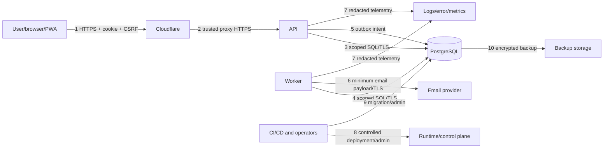

# KFin Threat Model

**Status:** Draft — review required 
**Version:** 0.1 
**Method:** Asset/threat-boundary analysis informed by STRIDE and abuse cases 
**Scope:** Proposed Private Beta Web/PWA, edge, API, worker, PostgreSQL, email, observability, CI/CD, backups, and operator access

No mitigation is currently implemented or tested. Risk ratings are design-time estimates and must be updated after provider selection, implementation review, testing, and incidents.

## 1. Security goals

- Prevent account takeover and unauthorized session persistence.
- Prevent any user from reading or changing another user’s data.
- Prevent false, duplicate, or hidden financial state changes.
- Prevent secrets and financial data from leaking through client storage, caches, logs, providers, backups, or errors.
- Preserve availability and recoverability under expected failure and bounded abuse.
- Retain enough trustworthy evidence to investigate security-sensitive actions without overcollecting private data.

## 2. Assets

| ID | Asset | Impact if compromised |
|---|---|---|
| A-01 | Password hashes and credential policy | Offline cracking, credential reuse, account takeover |
| A-02 | OTP/reset/invite/session bearer secrets | Immediate verification/recovery/session hijack |
| A-03 | User identity/profile/email/timezone | Privacy harm, phishing, account targeting |
| A-04 | Financial accounts, balances, transactions, notes | Severe privacy harm, manipulation, loss of trust |
| A-05 | Debts, obligations, savings goals, planned purchases | Sensitive inference, coercion/phishing, bad decisions |
| A-06 | Financial calculations and state links | False balance/spendable/payment status, duplicate effects |
| A-07 | Security/audit history | Covering tracks, misleading incident response |
| A-08 | Database/backups/restore copies | Bulk disclosure or destructive compromise |
| A-09 | Provider, CI/CD, database, and operator credentials | Platform takeover and supply-chain compromise |
| A-10 | Availability, email/reminder queue, recovery capability | Missed access/reminders, failed beta, data loss |
| A-11 | Source code/build/deployment integrity | Persistent compromise across users |

## 3. Actors

- Legitimate user on a trusted or shared/compromised device.
- Internet attacker with no account.
- Malicious or curious authenticated beta user.
- Credential-stuffing/brute-force automation.
- Abusive email/OTP cost attacker.
- Malware, browser extension, XSS payload, or stolen device acting with a user.
- Compromised dependency, CI runner, deployment artifact, or provider.
- Malicious/negligent operator or support person.
- External email/hosting/observability/database provider employee or attacker.
- Availability attacker using network or application-layer flooding.

## 4. Trust boundaries and data flows

Boundary-specific concerns:

1. Untrusted client input, stolen cookies, CSRF, XSS, local persistence.
2. Header spoofing, origin bypass, WAF/rate-control gaps, cache mistakes.
3–4. SQL injection, excessive DB role, missing tenant scope, pool/RLS context leak.
5–6. outbox duplication, secret payload, provider outage/webhook forgery.
7. sensitive logging, broad staff/vendor access, retention.
8–9. supply chain, stolen operator account, malicious migration/release.
10. backup exfiltration, untested/corrupt restore, residency/retention.

## 5. Assumptions and constraints

- Initial release has at most 50 invited users but remains Internet-accessible.
- Users manually enter data; KFin cannot verify it against a bank/lender.
- Same-origin browser delivery and PostgreSQL sessions are proposed, not yet validated.
- No bank/payment integrations, MFA, shared finances, file uploads, offline writes, or native package in MVP.
- Cloudflare, hosting, email, and observability providers are not selected.
- User device compromise cannot be fully prevented; impact can be reduced with revocation, XSS prevention, minimal local persistence, and security history.
- Legal jurisdiction, retention, residency, and operator staffing are unresolved.

Any changed assumption requires threat-model review.

## 6. Risk scale

- **Likelihood:** Low / Medium / High based on Internet exposure, attacker cost, and expected frequency.
- **Impact:** Low / Medium / High / Critical based on confidentiality, integrity, availability, user scope, and recovery.
- **Residual:** Expected risk after all planned mitigations work. It is not an acceptance decision.

## 7. Threat register

### Identity, credential, and session threats

| ID | Threat / attack path | Initial risk | Planned mitigations | Verification | Residual |
|---|---|---|---|---|---|
| TM-01 | Credential stuffing with reused email/password pairs | High/Critical | Invite gate; edge + IP/account/global throttles; generic errors; Argon2id; compromised-password screening; session/security events; future MFA seam | Automated distributed-pattern tests; manual enumeration review; alerts/tabletop | Medium/High without MFA |
| TM-02 | Brute-force password guessing against one/many accounts | High/High | Layered adaptive delays/limits; strong password policy; bounded worker/DB cost; generic response; alerting | Rate-limit/concurrency/load tests; bypass/header-spoof tests | Medium |
| TM-03 | Account enumeration through register/login/reset/OTP content, status, timing, or rate-limit differences | High/High | Generic content/status; normalized flow; bounded timing differences; same unavailable behavior; privacy-safe counters | Differential automated assertions and statistical timing review | Low/Medium |
| TM-04 | OTP guessing, resend abuse, email bombing, cost exhaustion, or queued-secret leakage | High/High | Cryptographic code; keyed digest; short expiry; five-attempt proposal; cooldown/target/IP/global caps; supersession; immediate ephemeral provider submission; no plaintext secret in ordinary outbox; minimum provider payload | Guess/resend/concurrency/replay/cost tests; outbox/log inspection; provider metrics | Medium |
| TM-05 | Password reset link theft, replay, substitution, host-header poisoning, or reset abuse | Medium/Critical | High-entropy single-use digest; short expiry; generic request; trusted canonical URL; no referrer/log; all-session revoke; security notification | Replay/race/open-redirect/host-header/log tests | Low/Medium |
| TM-06 | Weak/stolen password-hash database cracked offline | Medium/Critical | Argon2id benchmark; unique salt; common-password rejection; DB/private backup controls; rapid incident reset plan | Parameter benchmark; storage inspection; backup/IAM review | Medium |
| TM-07 | Session theft via XSS, logs, URL, JS storage, network, shared cache, or stolen device | High/Critical | HttpOnly Secure host-only cookie; TLS/HSTS; no local token/cache/log; CSP/XSS controls; idle/absolute expiry; session UI/revoke; no-store | Cookie/cache/client-storage/CSP/XSS tests; device-loss tabletop | Medium |
| TM-08 | Token replay or rotation race retains access | Medium/Critical | Digest-only token generations; atomic rotation; bounded grace; replay detection/revoke; session family; credential-change invalidation | Parallel-tab, retired-token, timeout-after-rotation, logout replay tests | Low/Medium |
| TM-09 | Session fixation or privilege/account switch confusion | Medium/High | New token after auth/verification; never accept client session ID; clear/revoke on transitions; same-user draft retry only | Fixation/auth-switch E2E tests | Low |
| TM-10 | CSRF performs financial/security mutation | High/Critical | SameSite cookie plus strict Origin/Fetch Metadata and unpredictable CSRF token; same-origin CORS; explicit content type | Cross-site form/fetch, missing/invalid token, allowed-origin test suite | Low |

### Authorization, application, and financial-integrity threats

| ID | Threat / attack path | Initial risk | Planned mitigations | Verification | Residual |
|---|---|---|---|---|---|
| TM-11 | IDOR/BOLA reads another user’s transaction, debt, goal, schedule, session, or notification | High/Critical | Server session identity; mandatory owner-scoped repositories; same-user composite FKs; generic unavailable; proposed RLS; no client ownership | Two-user resource × method matrix; code/SQL review; RLS tests | Low if fully enforced |
| TM-12 | BOLA/mass assignment changes owner/status/balance/audit/linked object | High/Critical | Explicit schemas/field allowlists; server-derived fields/calculations; owner scope on update/delete; version checks/constraints | Malicious extra-field/fuzz/cross-parent tests | Low |
| TM-13 | SQL injection through filters, sorting, search, notes, IDs, or migrations/admin tooling | Medium/Critical | Parameterized ORM/query; allowlisted identifiers; no string interpolation; least DB role; SAST/review | Injection corpus/API tests; SAST; query review | Low |
| TM-14 | Stored/reflected/DOM XSS steals session or financial data | Medium/Critical | React encoding; no raw HTML; CSP; bounded text; template escaping; no third-party scripts; HttpOnly cookie | XSS corpus, CSP/DAST, email-render tests | Low/Medium |
| TM-15 | Duplicate/replayed/parallel transaction creates multiple financial effects | High/High | User/operation-scoped idempotency; request digest; unique constraints; atomic result; disabled repeat submit; safe retry lookup | Parallel duplicate, timeout-after-commit, key-conflict tests | Low |
| TM-16 | Client manipulates amount, currency, date, aggregate, payment status, debt split, or ownership | High/Critical | Authoritative schemas/domain rules; integer bounds; currency/relationship checks; derive totals; explicit payment confirmation; atomic constraints | Boundary/property/fuzz tests; tampered API requests | Low |
| TM-17 | Due date or reminder falsely marks payment paid, or email webhook changes financial state | Medium/Critical | Schedule state separate from transaction; only explicit confirmation links posted transaction; delivery/webhook has no financial authority | Date-rollover/webhook spoof/state-machine tests | Low |
| TM-18 | Savings/planned purchase/debt records double-count or corrupt balance/spendable result | Medium/High | Separate ledgers/concepts; named formulas; atomic links; reconciliation checks; no auto interest; drill-down | Golden financial scenarios, property tests, reconciliation | Low/Medium pending decisions |
| TM-19 | Race between editing schedule/payment and worker reminders creates stale/incorrect actions | Medium/High | Version checks; row locks/atomic transitions; worker rechecks state after claim; idempotent keys; cancellation | Deterministic concurrency/clock tests | Low/Medium |
| TM-20 | Integer overflow, float precision, currency mismatch, or timezone boundary manipulates totals | Medium/High | BIGINT + checked arithmetic; no JS number for money; one currency; ISO dates/IANA timezone; bounded values | Property/boundary/month/DST/leap tests | Low |
| TM-21 | Malicious note/name content causes email header/template injection, log forging, or spreadsheet formula issue in future export | Medium/High | Length/schema validation; structured logs; escaping; no notes in email/log; future export sanitization spec | Payload corpus across UI/email/log; export blocked in MVP | Low |

### Privacy and data-leakage threats

| ID | Threat / attack path | Initial risk | Planned mitigations | Verification | Residual |
|---|---|---|---|---|---|
| TM-22 | Sensitive data leaks through errors, source maps, analytics, session replay, logs, traces, URLs, page title, or referrer | High/Critical | Safe errors/correlation; allowlist telemetry; no bodies/amounts/notes; session replay off; restricted source maps; no-referrer; no secrets in URL | Canary-secret/log scan; error/analytics/source-map review | Low/Medium |
| TM-23 | Browser/service worker/shared CDN caches authenticated financial data after logout/device sharing | Medium/Critical | API/private no-store; service-worker static allowlist; Cloudflare bypass; no offline private persistence; logout tests | Cache inspection and shared-cache tests across login/logout/update | Low |
| TM-24 | Email content exposes balances/debt/OTP on shared inbox/lock-screen or provider logs | Medium/High | Minimal subject/preview; amount opt-in/privacy review; short-lived secrets; provider retention review; no notes | Template/privacy review; provider log inspection | Medium |
| TM-25 | Operator/support/insider accesses or alters user data outside need | Medium/Critical | Least privilege; separate MFA identities; no shared account; audited access; approval/break-glass; app role restrictions; data minimization | IAM/access review; audit tests; insider tabletop | Medium |
| TM-26 | Cross-environment copy or debug tooling exposes production data | Medium/Critical | No prod data below prod; synthetic fixtures; environment credentials; restricted exports/debug; redaction | Pipeline/config review; DLP/manual checks | Low |
| TM-27 | User deletion/retention behavior leaves unexpected data across DB, logs, backup, provider | Medium/High | OQ-10 policy; data inventory; idempotent deletion; disclosed backup aging/provider retention; audit | End-to-end deletion/retention test after policy | Unknown until decision |

### Availability, API abuse, and exhaustion threats

| ID | Threat / attack path | Initial risk | Planned mitigations | Verification | Residual |
|---|---|---|---|---|---|
| TM-28 | Volumetric DDoS saturates public origin/network | Medium/High | Cloudflare DDoS/WAF; hidden/restricted origin; provider capacity; static edge delivery; runbook | Origin-bypass test; controlled provider exercise/tabletop | Medium/provider-dependent |
| TM-29 | Application-layer flooding of login, dashboard, search, recurrence, or history exhausts CPU/DB | High/High | Edge + app limits; body/time/range/pagination caps; indexed queries; pool/concurrency limits; caching only safe public assets; alerts | k6/abuse tests, slow-query plans, limit-bypass tests | Medium |
| TM-30 | Database connection/storage/table/index exhaustion from traffic, counters, logs, jobs, or unbounded records | Medium/Critical | Small pool/timeouts; bounded retention/pagination/generation; job/counter pruning; storage/pool alerts; quotas/limits | Soak/exhaustion tests; retention job tests; fail-closed behavior | Low/Medium |
| TM-31 | Email/provider outage or deliberate bounce abuse blocks auth/reminders | Medium/High | Outbox, bounded retries/dead letters, provider limits, health metrics, support fallback policy, financial state independent | Provider fault injection and retry/dedup tests | Medium |
| TM-32 | Worker crash/duplicate execution loses or repeats reminders/occurrences | Medium/High | Lease/reclaim; unique dedup keys; idempotent handlers; backlog alert; bounded generation | Kill-at-each-step tests, concurrent worker tests | Low |
| TM-33 | Expensive password hashing is weaponized for CPU denial | Medium/High | Edge/app login limits, global concurrency/semaphore, benchmarked cost, generic failure, capacity monitoring | Auth load/abuse test without weakening hash | Medium |

### Infrastructure, backup, and supply-chain threats

| ID | Threat / attack path | Initial risk | Planned mitigations | Verification | Residual |
|---|---|---|---|---|---|
| TM-34 | Backup compromise, public snapshot, stolen key, or malicious restore leaks all data | Medium/Critical | Managed encryption; restricted MFA IAM; audit; residency; separate backup permissions; isolated restore; retention | IAM/config audit; restore drill; exposure scanning | Medium/provider-dependent |
| TM-35 | Backups are corrupt/missing or restore exceeds tolerable loss/outage | Medium/Critical | Automated failure alerts; PITR/daily backup; recurring restore/reconciliation; measured RPO/RTO | Full restore exercise with evidence | Low/Medium |
| TM-36 | Compromised dependency/package/install script/base image injects code | Medium/Critical | Minimal locked dependencies; provenance/license/vulnerability review; SAST/SCA; restricted CI; supported base; artifact traceability | Dependency audit, SBOM/provenance check, update drill | Medium |
| TM-37 | CI/CD or operator credential compromise deploys malicious release/steals secrets | Medium/Critical | Provider MFA; least privilege; protected environments; reviewed required checks; short-lived workload credentials; audit; secret isolation | IAM review; unauthorized-deploy tabletop; credential rotation drill | Medium |
| TM-38 | Malicious/broken migration or direct DB command corrupts/exfiltrates data | Medium/Critical | Separate migration/operator role; PR review; staging rehearsal; lock timeout; backup; audited break-glass; no routine direct edits | Migration/rollback/restore exercise; permissions tests | Low/Medium |
| TM-39 | Cloudflare/origin/cache misconfiguration bypasses WAF or publicly caches private responses | Medium/Critical | Origin restriction; trusted-proxy allowlist; no-store/bypass API rules; config review/monitoring | Direct-origin and cache-key/cookie tests | Low/Medium |
| TM-40 | Email/webhook/provider impersonation or forged callback changes delivery state | Medium/Medium | TLS; provider webhook signature/timestamp/replay/idempotency; delivery-only authority | Invalid/replayed webhook tests | Low |
| TM-41 | Observability provider compromise exposes metadata or injected alert links phish operators | Low/High | Minimal redacted telemetry; MFA/RBAC; safe link/domain practice; retention; no secrets/payload | Provider/IAM review; canary checks | Low/Medium |

## 8. Priority abuse cases

### AC-01 — Authenticated user enumerates another user’s objects

Attacker changes UUIDs in Activity, debt, goal, schedule, notification, session, and nested endpoints; tries filters, bulk actions, update/delete, linked parent IDs, and timing. **Required outcome:** no data or existence leak, no state change, sanitized signal, and complete BOLA matrix evidence.

### AC-02 — Attacker creates false financial confidence

Attacker/tampered client sends a `paid` status without transaction, changes dashboard aggregate, confirms one transaction against two obligations, sends negative/overflow amount, changes currency, or replays an idempotency key. **Required outcome:** server rejects or performs one constrained atomic action; dashboard remains reproducible.

### AC-03 — Attacker abuses account lifecycle

Automation cycles register → resend OTP → reset → login across target/IP variation to enumerate, impose email cost, or seize an account. **Required outcome:** generic behavior, multi-dimensional cost controls, bounded provider/database work, alerts without locking legitimate users permanently.

### AC-04 — Stolen session remains useful after security action

Attacker replays current/previous token after logout, logout-all, password reset/change, account lock, rotation, and concurrent tabs. **Required outcome:** policy-consistent immediate rejection, containment/audit for replay, no fixation.

### AC-05 — Private content survives logout

Attacker on a shared device uses back/forward, service-worker cache, browser cache, offline state, IndexedDB, source map, notifications, or page title after logout. **Required outcome:** no deliberate persisted private API payload/token; browser limitations are documented; amount privacy policy is honored.

### AC-06 — Flood expensive paths

Attacker sends slow/large/parallel login hashes, month-range reports, occurrence generation, and arbitrary idempotency/counter keys to exhaust CPU, DB pool/storage, or email. **Required outcome:** limits bound work, critical paths remain recoverable, and alerts/runbooks activate.

## 9. Security design requirements derived from the model

- RQ-TM-01: Complete owner-scope and cross-user tests before any financial endpoint is called complete.
- RQ-TM-02: Treat schedules/notifications as intent only; posted transactions are the sole MVP cash movement truth.
- RQ-TM-03: Implement idempotency and atomic link constraints before enabling retry-prone financial confirmation.
- RQ-TM-04: Keep session/challenge bearer material digest-only and absent from all telemetry/client persistence.
- RQ-TM-05: Use same-origin + explicit CSRF defense and restrictive browser headers.
- RQ-TM-06: Bound every user-controlled collection, range, body, recurrence, retry, and worker claim.
- RQ-TM-07: Validate no-store/service-worker/Cloudflare cache configuration in deployed staging, not only unit tests.
- RQ-TM-08: Prove restore and rollback; do not equate backup configuration with recovery.
- RQ-TM-09: Select providers only after data flow, IAM, retention, residency, webhook, and incident review.
- RQ-TM-10: Resolve debt/savings/safe-to-spend semantics so incorrect financial advice is not implemented as a security/integrity flaw.

## 10. Security test focus

Required suites are detailed in the test strategy and include:

- authentication state-machine and concurrent replay tests;
- enumeration comparison across content/status/timing/rate-limit paths;
- CSRF/CORS/cookie/header/cache tests on deployed staging;
- full BOLA/IDOR matrix with cross-parent linkage;
- SQLi/XSS/template/log injection corpus;
- money/date/timezone/property tests and malicious transaction API calls;
- idempotency timeout/parallel/reuse behavior;
- worker crash/reclaim/dedup and provider fault injection;
- application-layer load/database exhaustion tests;
- secret/PII/financial-data canary scan across logs, analytics, errors, cache, URLs, emails;
- IAM/origin/database network/backup review and restore exercise;
- dependency/supply-chain and unauthorized deployment tabletop.

## 11. Residual risks requiring explicit acceptance

Before beta, owners must assess and accept/reduce:

- password-only authentication without MFA;
- user device/email account compromise;
- manual and potentially stale financial data producing an imperfect spendable estimate;
- single-region/provider availability within approved RTO;
- provider insider/subprocessor exposure;
- approximate device/network security-history data;
- external email’s inability to guarantee exactly-once delivery or inbox privacy;
- deletion from aged backups under approved retention;
- any decision not to implement PostgreSQL RLS.

## 12. Review and maintenance

Review this model:

- before implementation starts;
- after provider/region/session/RLS/product decisions;
- before each cohort expansion;
- after a security incident or meaningful near miss;
- when adding native mobile, push, export, sharing, bank integration, multiple currencies, MFA, or new operator tooling;
- at least once per major release.

Each review updates assets, boundaries, threats, implemented controls, test evidence, incidents, residual risk owner, and review date.
